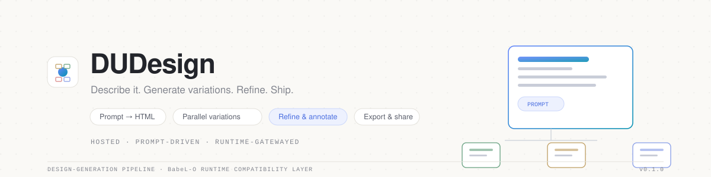
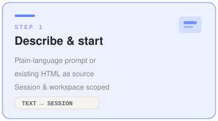
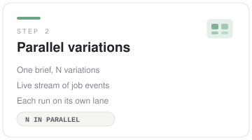
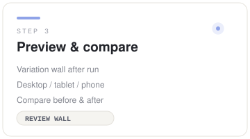
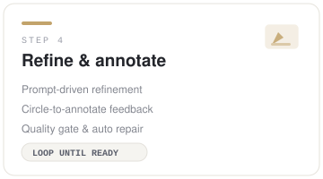
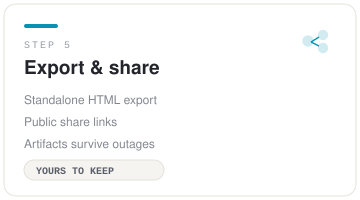
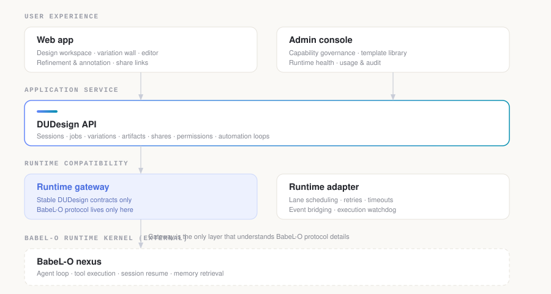
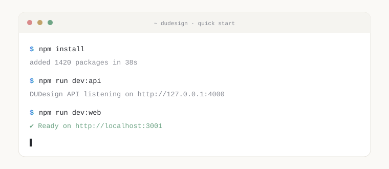

<div align="center">



<br/>

<a href="https://kezhongke.cn/projects/dudesign/"></a>
<a href="http://49.233.190.201/dudesign"></a>
<a href="LICENSE"></a>
= 22"/>

**DUDesign** 是一个托管的 AI 前端设计平台：用自然语言描述一个页面——或直接带上已有 HTML——DUDesign 会并行生成多个设计变体，让你逐个预览、精修、圈画批改，最后导出或分享成果。

[English](README.md) · [中文](README.zh-CN.md)

</div>

---

## 工作流程

整个产品是一条管线：描述 → 生成 → 审阅 → 精修 → 交付。

### 01 · 描述并开始



用自然语言创建会话，或上传已有 HTML 作为改造源。会话与工作区让每个项目井然有序且可恢复——刷新浏览器后可以接着上次继续。

```
"为一款智能咖啡机制作一个落地页"
→ 创建会话 → 设计任务入队
```

<br clear="all"/>

### 02 · 并行变体



一个需求，N 个变体。每个变体在独立运行时车道上并行执行，任务事件实时流向浏览器——你看着设计成形，而不是对着加载圈等待。

<br clear="all"/>

### 03 · 预览与对比



完成的变体落在结果墙上，支持桌面 / 平板 / 手机多端预览。精修前后状态可并排对比，任一变体都能进入编辑器继续调整。

<br clear="all"/>

### 04 · 精修与批改



用提示词驱动下一轮迭代，或在渲染页面上圈画标注要修改的位置。产物质量门禁检查生成结果，自动化循环自动修复问题——审阅模式覆盖手动、半自动到全自动。

<br clear="all"/>

### 05 · 导出与分享



导出最终独立 HTML，或发布分享链接。即使运行时不可用，已生成的产物依然可用——产品永远不会把你的产出扣下。

<br clear="all"/>

## 核心能力

| | | |
|---|---|---|
|  **设计方向系统** |  **自动化循环** |  **托管工作区** |
| 场景模板、视觉风格、配色、品牌参考与模板包共同塑造每次生成。 | 内置质量门禁、修复循环与审阅模式（关闭 / 半自动 / 全自动）。 | 会话、工作区与用户记忆——一切可恢复、按用户隔离。 |
|  **稳定契约 · 干净边界** |  **管理后台** |  **治理完善的 Monorepo** |
| 产品代码只通过版本化契约与运行时网关对接运行时。 | 能力治理、模板库、运行时健康、用量与审计视图。 | 类型安全包、契约测试、staging 部署工具链与 ADR 决策记录。 |

## 架构

DUDesign 把 BabeL-O 视为**外部运行时内核**。产品逻辑从不 import 或暴露 BabeL-O 内部实现；运行时网关是唯一理解 BabeL-O 协议细节的层。



- **用户体验层** — Web 应用（工作台、结果墙、编辑器）与管理后台。
- **应用服务层** — 会话、任务、变体、产物、分享、权限与自动化循环。
- **运行时兼容层** — 稳定 DUDesign 契约的网关，以及负责车道调度、重试与事件桥接的适配器。
- **BabeL-O 运行时内核** — 外部；负责 agent 循环、工具执行、会话恢复与记忆检索。

## 仓库结构

```text
apps/
  web/                # 面向用户的前端应用（Next.js）
  admin/              # 管理与开发者控制台（Next.js）
  api/                # 应用服务 API
  runtime-adapter/    # BabeL-O 运行时适配器

packages/
  contracts/          # 稳定的 DUDesign API 与事件契约
  domain/             # 业务模型与状态
  runtime-gateway/    # BabeL-O 兼容边界
  artifact-store/     # 产物存储抽象

deploy/staging/       # Docker Compose 预发布栈、发布脚本、nginx 配置
docs/                 # 架构规划、ADR、模块工作日志
```

## 快速开始

环境要求：**Node.js >= 22** 与 npm。



```bash
npm install          # 安装全部工作区依赖
npm run typecheck    # 对所有包与应用做类型检查
npm test             # 单元 / 集成测试（无需外部服务）
```

本地启动整套服务：

```bash
npm run dev:api      # API → http://127.0.0.1:4000
npm run dev:web      # Web 应用 → http://localhost:3001
npm run dev:admin    # 管理后台 → http://localhost:3002
```

如需让 Web 应用指向其他 API：

```bash
NEXT_PUBLIC_DUDESIGN_API_URL=http://127.0.0.1:4000
```

## 常用脚本

| 脚本 | 说明 |
| --- | --- |
| `npm run typecheck` | 对所有包与应用做类型检查。 |
| `npm test` | 单元 / 集成测试门禁（契约、网关、适配器、API）。 |
| `npm run test:ux` | UX HTTP 冒烟；需要 API 与 Web 服务已启动。 |
| `npm run test:ux:e2e` | 浏览器 E2E；需要 API 与 Web 服务已启动。 |
| `npm run dev:api` | 先类型检查，再以 watch 模式运行 API。 |
| `npm run dev:web` | 在 3001 端口启动 Next.js Web 应用。 |
| `npm run start:api` | 先类型检查，再启动构建后的 API。 |
| `npm run start:web` | 启动构建后的 Web 应用（3001）。 |

## 链接与文档

- 🌐 [产品落地页](https://kezhongke.cn/projects/dudesign/)
- 🚀 [在线体验](http://49.233.190.201/dudesign)
- [在线设计平台规划](docs/online-design-platform-plan.md)
- [架构治理规划](docs/architecture-governance-plan.md)
- [架构决策记录（ADR）](docs/adr/)
- [模块规划索引](docs/modules/README.md)

## 许可证

MIT。见 [LICENSE](LICENSE)。
