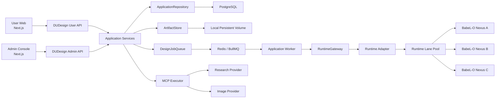

# DUDesign 架构演进治理规划

> 版本：v1.0  
> 日期：2026-07-11  
> 状态：执行基线  
> 适用阶段：动态百科业务深化、Staging 收口、Production 上线准备  
> 关联文档：
> - `docs/architecture-governance-plan.md`：四层架构原则与初始治理基线
> - `docs/online-design-platform-plan.md`：产品与系统总体规划
> - `docs/development-release-governance.md`：开发、测试、发布和回滚流程
> - `docs/modules/README.md`：四层模块 TODO 与 WORKLOG 索引
> - `docs/modules/runtime-compatibility/runtime-lane-pool-plan.md`：Runtime Lane Pool 专项规划

## 1. 文档目的

DUDesign 已从最初的 contract-first MVP 骨架，发展为包含真实登录、PostgreSQL、Redis/BullMQ、Artifact Store、用户端、管理端、Runtime Gateway、Runtime Adapter、BabeL-O Lane Pool、Capability Distribution、MCP、动态百科分类与规范审查的完整系统。

原有四层架构方向仍然成立，但当前实现已经出现新的治理问题：

- `ApplicationService` 持续吸收不同领域逻辑，逐渐成为巨型应用服务。
- `PostgresRepository` 仍继承 `InMemoryStore`，生产持久化与开发内存模型存在双事实来源风险。
- Runtime 公共契约仍以 BabeL-O 为中心，不利于后续 CLI Agent 或其他 runtime provider 接入。
- 用户 API 和用户前端开始接触 runtime lane、backend、lease、child session 等诊断信息。
- Artifact Store 虽有抽象，但生产工厂仍只使用本地文件系统。
- 用户 memory namespace 已隔离，但长期记忆的事实模型、审批和持久化尚未完成。
- Runtime Lane Pool 已能调度，但管理端控制面和运行指标尚未完全跟上。

本规划不推翻现有架构，也不要求立即微服务化。目标是在保持交付速度的同时，把当前系统治理为：

```text
边界清晰的模块化单体
  + 独立任务 Worker
  + 独立 Runtime Compatibility Service
  + 可替换持久化与 Artifact Provider
  + 可观察、可降级、可回滚的运行控制面
```

## 2. 架构评估结论

### 2.1 总体判断

当前架构整体合理，适合 MVP 和早期上线阶段，综合评估为：

| 维度 | 评价 | 说明 |
| --- | --- | --- |
| 四层职责划分 | 良好 | 用户端、管理端、业务服务、内核兼容层边界清楚 |
| BabeL-O 解耦 | 良好 | 已有 Gateway、Adapter、Contract Test、Golden Replay 和降级路径 |
| 业务持久化 | 中等 | PostgreSQL 已落地，但仍与内存实现存在继承和 hydrate 关系 |
| 异步任务治理 | 良好 | 已有 Queue interface、Redis/BullMQ 和独立 Worker |
| Artifact 治理 | 中等 | Artifact version 和安全访问完整，但存储仍以本地卷为主 |
| Runtime 可扩展性 | 中等 | Lane Pool 已落地，但 provider contract 仍写死 BabeL-O |
| 管理控制面 | 中等 | 已有治理页面，Lane/Contract/Drift 的操作闭环仍需补齐 |
| 可维护性 | 需治理 | API、Repository、部分前端页面文件体积过大 |
| 多实例生产能力 | 需治理 | Local Artifact、hydrate cache 和部分进程内状态限制水平扩容 |

### 2.2 不建议采取的方向

当前阶段不建议：

- 把 Auth、Session、Job、Artifact、Template 分别拆成独立微服务。
- 为追求形式上的“纯架构”重写现有 API。
- 同时替换 HTTP 框架、ORM、Queue、数据库和 Runtime。
- 在没有稳定业务边界前引入复杂服务发现或 Kubernetes 自动扩缩容。
- 让用户直接选择某条 Runtime Lane 或某个 BabeL-O 实例。

这些动作会增加分布式事务、调试、部署、鉴权和数据一致性成本，却不能直接解决当前最主要的代码集中和协议泄露问题。

## 3. 当前实际架构



当前部署边界总体合理：

- `apps/web`：用户前端。
- `apps/admin`：管理员和开发者控制台。
- `apps/api`：User API、Admin API 和应用服务。
- `apps/api` worker entrypoint：异步任务消费者。
- `apps/runtime-adapter`：DUDesign 到 BabeL-O Nexus 的服务防腐层。
- `packages/contracts`：前后端共享 API/Event contract。
- `packages/domain`：业务实体。
- `packages/runtime-gateway`：Runtime Gateway interface 和 provider client。
- `packages/artifact-store`：Artifact body 存储接口。

## 4. 目标架构原则

### 4.1 保持四层，不新增业务架构层

Capability Distribution、动态百科、Memory、Model Governance 都是跨层业务能力，不应新增第五层或第六层。它们必须分别落入：

- 用户交互。
- 管理治理。
- 应用业务事实。
- Runtime 编译与适配。

### 4.2 模块化单体优先

业务服务继续部署为一个 API 和一个 Worker，但内部按领域拆分。模块化的判断标准是：

- 每个模块有明确输入输出。
- 模块只能通过公开 service/interface 交互。
- 模块不能直接读取其他模块的内部 map、SQL 或 runtime payload。
- 单个业务能力的修改不应持续触碰同一个巨型文件。

### 4.3 PostgreSQL 是生产业务事实来源

生产环境必须满足：

- PostgreSQL 是用户、workspace、session、job、variation、artifact metadata、share、usage 和 audit 的唯一事实来源。
- API/Worker 重启不改变业务状态。
- 多个 API/Worker 实例不依赖各自进程内缓存保持一致。
- hydrate 只能作为开发或迁移期兼容能力，不能成为 production 正确性的前提。

### 4.4 Artifact body 独立于业务数据库

PostgreSQL 保存 artifact metadata，不保存大体积 HTML、图片和 ZIP body。Artifact body 通过统一 `ArtifactStore` 保存：

- Local provider：本地开发、单机测试。
- S3-compatible provider：Staging/Production。

### 4.5 Runtime Provider 中立

业务层依赖的是“设计运行能力”，不是 BabeL-O 本身。稳定契约应该描述：

- 是否支持 session resume。
- 是否支持 parallel variation。
- 是否支持 refine。
- 是否支持 streaming。
- 是否支持 workspace files。
- 是否支持 tool calling。
- 是否支持 memory context。
- 是否支持 cancel。

BabeL-O、CLI Agent、Mock Runtime 都只是 provider。

### 4.6 User Contract 与 Admin Diagnostic Contract 分离

用户只应看到：

- 任务阶段。
- 进度。
- 是否重试。
- 是否降级。
- 用户可理解的错误。
- token/cost/time。

管理员和开发者才可以看到：

- runtime provider。
- lane/backend/lease。
- runtime session/agent job。
- contract version。
- drift。
- 原始错误摘要和 retry trace。

## 5. 目标代码结构

本规划不要求一次性搬迁所有文件。建议逐步演进为：

```text
apps/
  web/
  admin/
  api/
    src/
      server/
        user-routes/
        admin-routes/
        middleware/
      application/
        auth/
        sessions/
        design-jobs/
        variations/
        artifacts/
        capabilities/
        encyclopedia/
        governance/
      infrastructure/
        persistence/
        queue/
        mcp/
        observability/
      composition/
        serviceFactory.ts
  runtime-adapter/

packages/
  contracts/
    user-api/
    admin-api/
    events/
    runtime/
  domain/
  artifact-store/
  runtime-gateway/
```

短期可以保留现有目录，只要新增代码开始遵循上述边界。

## 6. 核心治理议题

### 6.1 ApplicationService 拆分

#### 当前问题

`apps/api/src/service.ts` 已同时负责：

- Auth 和 OAuth。
- Workspace、Session、Message。
- Design Job、Variation、Refine。
- Artifact、Preview、Export、Share。
- Capability 和 Template。
- MCP invocation。
- 动态百科 Guidance 和 Spec Review。
- Admin Governance。
- Runtime event orchestration。
- Screenshot 和 Automation Loop。

这会带来：

- 修改冲突集中。
- 单元测试难以隔离。
- 构造依赖越来越多。
- 管理端和用户端业务边界不清晰。
- 私有 helper 难以复用或替换。

#### 目标方案

保留一个组合入口，但把功能拆成应用服务：

```ts
type ApplicationServices = {
  auth: AuthApplicationService
  sessions: SessionApplicationService
  designJobs: DesignJobApplicationService
  variations: VariationApplicationService
  artifacts: ArtifactApplicationService
  capabilities: CapabilityApplicationService
  encyclopedia: EncyclopediaApplicationService
  admin: AdminApplicationService
}
```

`ApplicationService` 可以在迁移期作为 facade，向现有 route 和测试保持旧方法兼容，再逐步让 routes 直接依赖细分服务。

#### 拆分顺序

1. 提取无状态纯函数和 DTO mapper。
2. 提取 Admin 查询与治理服务。
3. 提取 Auth/OAuth 服务。
4. 提取 Artifact/Preview/Export/Share 服务。
5. 提取 Capability/Encyclopedia 服务。
6. 最后收口 Design Job/Variation orchestration。

不建议先拆 Design Job，因为它与 Queue、Runtime、Artifact 和 Automation Loop 的耦合最高。

### 6.2 Repository 去继承化

#### 当前问题

`PostgresRepository extends InMemoryStore` 属于迁移期结构。长期风险包括：

- SQL 状态和内存状态可能不一致。
- 某些方法可能不小心落入父类内存实现。
- hydrate 时间随数据增长。
- 多 API 实例拥有不同内存副本。
- production no-hydrate 路径容易缺少覆盖。

#### 目标方案

```ts
class InMemoryRepository implements ApplicationRepository
class PostgresRepository implements ApplicationRepository
```

两者共享：

- 纯 mapper。
- 输入校验。
- 排序规则。
- DTO assembler。
- Repository contract tests。

两者不共享：

- 内存 map。
- 数据写入状态。
- 隐式 fallback。

#### 迁移策略

1. 列出仍由父类提供的 Repository 方法。
2. 给每个方法增加 SQL-native 实现。
3. 同一套 contract test 分别运行在 InMemory 和 PostgreSQL。
4. Production 默认 `hydrateOnStart=false`。
5. 删除生产读路径中的内存 fallback。
6. 最后移除继承关系。

### 6.3 User/Admin Contract 分离

#### 当前问题

部分用户 DTO/Event 已包含：

- `runtimeLaneId`
- `runtimeBackendId`
- `runtimeLeaseId`
- `runtimeChildSessionId`
- `runtimeAgentJobId`

这些字段是运维诊断信息，不属于用户产品语义。

#### 目标方案

定义两套响应：

```ts
type UserVariationSnapshot = {
  id: string
  index: number
  status: VariationStatus
  execution: {
    phase: 'queued' | 'generating' | 'rendering' | 'completed' | 'failed'
    retrying: boolean
    degraded: boolean
    message?: string
  }
}

type AdminVariationDiagnostics = {
  runtimeProviderId: string | null
  runtimeLaneId: string | null
  runtimeBackendId: string | null
  runtimeLeaseId: string | null
  runtimeChildSessionId: string | null
  runtimeAgentJobId: string | null
  runtimeAttempt: number
  runtimeLastErrorCode: string | null
}
```

事件也应区分：

- User Event：稳定产品状态。
- Admin Diagnostic Event：lane assignment、retry trace、contract drift。
- Internal Runtime Event：仅用于 Adapter/Gateway。

### 6.4 Runtime Provider 泛化

#### 当前问题

`RuntimeHealth.runtime` 和 `RuntimeContract.runtime` 当前固定为 `'babel-o'`；provider 配置不是 `babel-o` 时会回退到 Mock Runtime。

风险：

- CLI Agent 无法自然实现同一契约。
- provider 拼写错误可能意外启用 Mock。
- Capability negotiation 仍围绕 BabeL-O endpoint，而不是设计运行能力。

#### 目标方案

```ts
type RuntimeProviderId = 'mock' | 'babel-o' | 'cli-agent' | string

type RuntimeCapabilities = {
  sessionResume: boolean
  parallelVariations: boolean
  streaming: boolean
  refine: boolean
  cancel: boolean
  workspaceFiles: boolean
  toolCalling: boolean
  memoryContext: boolean
}

type RuntimeContract = {
  providerId: RuntimeProviderId
  providerVersion: string | null
  contractVersion: string
  status: RuntimeContractStatus
  capabilities: RuntimeCapabilities
}
```

Provider factory 必须：

- 显式 `mock` 才能启用 Mock Runtime。
- `babel-o` 创建 BabeL-O Gateway。
- `cli-agent` 创建 CLI Agent Gateway。
- 未知 provider 直接启动失败。

#### Runtime Context 编译

业务层不应把动态百科完整业务模型直接传给 Gateway。应先编译为稳定的 Runtime Design Context：

```ts
type RuntimeDesignContextV1 = {
  schemaVersion: 'dudesign-runtime-context.v1'
  instructions: string[]
  constraints: Array<{
    id: string
    severity: 'required' | 'preferred' | 'avoid'
    description: string
  }>
  artifacts: RuntimeArtifactReference[]
  toolPolicy: RuntimeToolPolicy
  memoryContext?: RuntimeMemoryContext
  metadata: Record<string, string | number | boolean>
}
```

Gateway 只负责把该 context 转换为 provider 输入。

### 6.5 Artifact Store 生产化

#### 当前问题

`ArtifactStore` 接口已经合理，但 composition root 始终创建 `LocalArtifactStore`。这要求 API 和 Worker 共享同一个持久卷，限制：

- API/Worker 跨机器部署。
- 多实例水平扩展。
- 容器替换和灾备。
- CDN 和大文件分发。

#### 目标方案

新增：

```text
DUDESIGN_ARTIFACT_PROVIDER=local
DUDESIGN_ARTIFACT_PROVIDER=s3
```

S3-compatible provider 至少支持：

- put/get/delete。
- content type 和 metadata。
- immutable version key。
- signed read URL。
- server-side encryption。
- workspace/user prefix。
- hash 和 size 校验。

Staging 可以先接 MinIO 或云对象存储，Production 不应依赖 API 容器本地磁盘保存用户成果。

### 6.6 Queue 与 Worker 边界

现有 Queue interface 和 Worker 分离方向正确，应继续坚持：

- API 只创建业务事实并入队。
- Worker 执行 Runtime、Artifact Bridge、Screenshot 和 Quality Gate。
- Queue payload 只传业务 ID 和版本化参数，不传大体积 HTML。
- Worker 启动后从 Repository/Artifact Store 读取权威上下文。
- Job handler 必须幂等。

后续新增：

- Preview Quality Job 独立类型。
- Dead-letter 查询与重放。
- Job lease/heartbeat。
- Worker shutdown drain。
- Queue backlog、age、retry 和 failure metrics。

### 6.7 Memory 系统

当前 `memoryNamespace` 唯一约束已形成用户隔离基础，但长期记忆还需要自己的业务事实模型：

```text
memory_notes
memory_note_sources
memory_note_approvals
memory_usage_events
```

Memory 分类：

- `preference`：模板、颜色、布局、语言、设备偏好。
- `project_context`：workspace 范围内长期上下文。
- `temporary_hint`：仅当前 session 使用。
- `fact_candidate`：需要来源和审批，不能直接当作事实。

规则：

- 用户记忆和公开 research context 必须保留来源边界。
- 默认不把 MCP 返回内容写入长期记忆。
- 用户可以查看、编辑、删除偏好记忆。
- 管理端只能观察隔离和审批状态，不能默认读取完整私有内容。

### 6.8 Runtime Lane 控制面

Lane Pool 已具备调度基础，下一步不是继续增加调度复杂度，而是补控制面：

- lane health。
- provider/backend。
- inflight/maxConcurrent。
- contract status。
- timeout 和 failure rate。
- 最近错误。
- 最近 smoke 时间。
- drain/undrain。
- 单 lane contract check。
- 单 lane smoke。
- lane 到 job/variation 的反查。

用户前端只展示“系统繁忙、自动切换线路、正在重试”等产品状态。

## 7. 依赖规则

### 7.1 允许的依赖

```text
apps/web -> packages/contracts/user-api
apps/admin -> packages/contracts/admin-api
apps/api/server -> apps/api/application
apps/api/application -> packages/domain
apps/api/application -> Repository / Queue / Artifact / Runtime interfaces
apps/api/infrastructure -> external libraries and providers
packages/runtime-gateway -> packages/contracts/runtime
apps/runtime-adapter -> packages/runtime-gateway
```

### 7.2 禁止的依赖

- 用户前端 import Admin DTO。
- 用户前端展示 runtime session、lane、backend 或 lease id。
- Admin 前端直接请求 Runtime Adapter。
- Application Service import BabeL-O 私有类型。
- Runtime Gateway 直接读取 DUDesign PostgreSQL。
- Repository 调用 Runtime Gateway。
- Domain package 依赖 HTTP、PostgreSQL、Redis、Playwright 或 Node 文件系统。
- Queue payload 包含完整 HTML、图片 body、密钥或未经脱敏的 provider response。
- Unknown runtime provider 自动回退到 Mock。

### 7.3 自动化约束建议

引入轻量架构测试，而不是立即使用复杂框架：

- `rg`/Node test 检查 `apps/web` 不出现 `NexusEvent`、`BABELO_*`。
- 检查用户 DTO 不包含 runtime diagnostic 字段。
- 检查 `packages/domain` 不依赖基础设施包。
- 检查只有 runtime compatibility 模块可以出现 BabeL-O endpoint。
- 检查 Admin 写 API 都调用 audit helper。

后续可引入 dependency-cruiser 或 ESLint import boundary 规则。

## 8. 分阶段实施计划

### Phase AG-0：架构基线固化

目标：让架构规则可检查、可追踪。

任务：

- [x] 确认本规划为当前架构演进基线。
- [~] 建立架构违规清单和例外登记；首版自动检查已覆盖用户端 runtime 私有概念、User Job Snapshot 诊断字段和 unknown provider fallback，例外登记流程待后续补齐。
- [x] 增加依赖方向 smoke test。
- [x] 明确 User API、Admin API、Runtime Contract 的 owner。
- [x] 新增重大架构变更 ADR 模板。

验收：

- CI 可以发现前端直连 runtime、domain 依赖基础设施等明显违规。
- 每项架构例外都有 owner、原因和退出时间。

### Phase AG-1：用户与管理协议收口

目标：Runtime 诊断信息不再泄露到用户产品面。

任务：

- [x] 新增 `UserVariationExecution`，作为用户 Job Snapshot 的运行状态边界。
- [x] 新增 `AdminVariationRuntimeDiagnostics` contract，并在 Admin Job Variation 中保留完整 runtime diagnostics。
- [~] 用户事件移除 lane/backend/lease/session 等原始引用；HTTP Job Snapshot 和用户 Activity Stream 已收口，内部持久化事件暂保留供 Application Service 和 Admin 诊断使用。
- [x] 用户 Activity Stream 改为产品化状态，不再展示 runtime child session / agent job id。
- [x] Admin API 保留完整 runtime diagnostics。
- [x] 增加 User/Admin contract 与真实 API flow 边界测试。

验收：

- 用户端源码不展示 runtime external id。
- Lane Pool 调整不需要修改用户前端。

### Phase AG-2：ApplicationService 模块化

目标：降低单文件复杂度，不改变部署拓扑和外部 API。

任务：

- [x] 建立 `application/` 模块目录。
- [~] 提取 DTO mapper 和纯业务 helper；首轮 User Variation execution mapper 已显式化，其他 mapper 随领域拆分继续迁移。
- [~] 提取 Admin Governance Service；首轮完成 Admin Runtime Governance，其他 Admin capability/model/job 治理后续继续拆分。
- [x] 提取 Auth/OAuth Service。
- [ ] 提取 Artifact Service。
- [ ] 提取 Capability/Encyclopedia Service。
- [x] `ApplicationService` 暂时保留 facade。
- [x] 为首轮拆出的服务增加独立单元测试。

验收：

- 新增管理端或 Capability 功能不再默认修改 `service.ts`。
- 核心业务服务可以用 mock ports 独立测试。
- 原有 API/E2E 保持兼容。

### Phase AG-3：Repository 生产事实收口

目标：PostgreSQL 成为唯一生产事实来源。

任务：

- [ ] 输出父类继承方法使用清单。
- [ ] 补齐全部 SQL-native query/write。
- [ ] 同一套 Repository contract test 覆盖两种实现。
- [ ] Staging 默认关闭 hydrate。
- [ ] 多 API 实例 smoke。
- [ ] 移除 `PostgresRepository extends InMemoryStore`。

验收：

- `PostgresRepository implements ApplicationRepository`。
- API/Worker 多实例下读写一致。
- 重启和 no-hydrate 不影响核心流程。

### Phase AG-4：Artifact Store 生产化

目标：API、Worker 和 Preview 可以跨机器共享 artifact。

任务：

- [ ] 实现 S3-compatible Artifact Store。
- [ ] 增加 provider factory 和配置校验。
- [ ] 增加 signed URL、hash、metadata、delete 测试。
- [ ] Staging 接入对象存储。
- [ ] 增加本地卷到对象存储的迁移工具。
- [ ] 增加 artifact 备份和生命周期策略。

验收：

- API/Worker 不共享本地卷也能生成、预览、导出和分享。
- Artifact Store provider 切换不影响业务 metadata。

### Phase AG-5：Runtime Provider 中立化

目标：DUDesign 可以同时支持 BabeL-O 和 CLI Agent，而不修改业务核心。

任务：

- [ ] 将 runtime literal 泛化为 provider id。
- [ ] 定义 Runtime Capabilities。
- [ ] 定义 `RuntimeDesignContextV1`。
- [ ] 把动态百科业务模型编译为标准 context。
- [ ] Runtime Provider Registry。
- [ ] Unknown provider fail fast。
- [ ] 增加 `CliAgentRuntimeGateway` mock/fixture 实现。
- [ ] 同一套 Gateway contract test 覆盖 Mock、BabeL-O、CLI fixture。

验收：

- `DUDESIGN_RUNTIME_PROVIDER=cli-agent` 可跑 mock/fixture design job。
- Application Service 不出现 CLI 或 BabeL-O 私有协议判断。

### Phase AG-6：运行控制面与可观测性

目标：系统不仅能运行，还能被管理、解释和回滚。

任务：

- [ ] Admin Runtime Lane 列表。
- [ ] Lane inflight、失败率、timeout、contract status。
- [ ] Lane drain/undrain 与审计。
- [ ] Contract test 结果展示。
- [ ] Runtime config rollback。
- [ ] Queue backlog 和 dead-letter 查询。
- [ ] Preview Quality Worker 指标。
- [ ] Dashboard 与告警阈值。

验收：

- 管理员可以定位一次失败来自 API、Queue、Runtime、Artifact 还是 Preview。
- Runtime 升级可灰度、可观测、可回滚。

### Phase AG-7：Production Hardening

目标：满足真实用户上线门禁。

任务：

- [ ] OAuth provider staging smoke。
- [ ] HTTPS、Secure Cookie、可信代理配置。
- [ ] 用户/workspace 用量硬配额。
- [ ] Memory Notes 和用户管理入口。
- [ ] 数据备份和恢复演练。
- [ ] 密钥轮换流程。
- [ ] 限流、审计保留和安全扫描。
- [ ] 多用户隔离与 public share 渗透测试。

验收：

- 完成 Production Readiness Review。
- 核心数据、artifact 和 runtime 配置均有恢复方案。

## 9. 推荐执行顺序

推荐优先级：

```text
AG-0 架构基线
  -> AG-1 用户/Admin 协议收口
  -> AG-2 ApplicationService 模块化
  -> AG-3 Repository 去继承化
  -> AG-4 S3 Artifact Store
  -> AG-5 Runtime Provider 中立化
  -> AG-6 控制面与可观测性
  -> AG-7 Production Hardening
```

其中：

- AG-1 和 AG-6 可以部分并行。
- AG-4 必须在 API/Worker 跨机器或多实例前完成。
- AG-5 可以先做 contract 泛化，再逐步实现真实 CLI Provider。
- AG-7 中 OAuth/HTTPS/配额不必等待全部架构治理完成。

## 10. 首轮建议里程碑

### M1：Architecture Boundary Baseline

范围：

- 架构依赖 smoke。
- Runtime provider fail-fast。
- User/Admin runtime diagnostics DTO 草案。
- ADR 模板。

预计收益：

- 防止继续增加 runtime 泄露。
- 为后续 CLI Provider 和 Lane 管理端建立稳定契约。

### M2：ApplicationService First Split

范围：

- 提取 Admin Governance Service。
- 提取 Auth/OAuth Service。
- 保持现有 route 和 facade。

状态：

- [x] `AuthApplicationService` 已完成。
- [x] `AdminRuntimeGovernanceService` 已完成。
- [x] 独立服务不依赖 `ApplicationService` facade 的架构门禁已完成。
- [ ] 其他 Admin Governance 子域将在后续里程碑继续迁移。

预计收益：

- 两块相对独立、风险较低，适合作为拆分方式验证。

### M3：PostgreSQL No-Hydrate Production Gate

范围：

- Repository 方法覆盖审计。
- no-hydrate 全 API smoke。
- 多实例一致性 smoke。

预计收益：

- 明确 PostgreSQL 是否已经可以真正承载 production source of truth。

### M4：S3 Artifact Provider

范围：

- S3-compatible adapter。
- Staging 配置。
- 迁移和回滚说明。

预计收益：

- 解除 API/Worker 对共享本地卷的依赖。

## 11. 测试门禁

### 11.1 默认门禁

```bash
npm run typecheck
npm test
```

### 11.2 架构门禁

- User Web 不引用 Admin Contract。
- User Web 不出现 BabeL-O/Nexus/raw runtime id。
- Domain 不依赖基础设施。
- Runtime Provider 未识别时启动失败。
- User API 不返回 Admin diagnostics。

### 11.3 Repository 门禁

- InMemory contract suite。
- PostgreSQL contract suite。
- no-hydrate API smoke。
- 两实例并发读写 smoke。
- migration from previous release。

### 11.4 Runtime 门禁

- Runtime contract negotiation。
- Golden event replay。
- Resume/refine/cancel。
- 3/6 variation。
- Lane failure/retry/drain。
- Provider unavailable/degraded/mismatch。

### 11.5 Production 门禁

- OAuth。
- HTTPS/Cookie。
- PostgreSQL backup/restore。
- Artifact backup/restore。
- Queue retry/dead-letter。
- 多用户隔离。
- 分享只读和版本不漂移。
- 配额超限。
- Runtime unavailable 下历史成果可访问。

## 12. 架构指标

建议每个里程碑记录：

| 指标 | 目标 |
| --- | --- |
| `ApplicationService` 新增功能修改率 | 持续下降 |
| 单个生产源文件行数 | 原则上不再新增超过 1500 行文件 |
| User Contract 中 runtime diagnostic 字段 | 0 |
| Production hydrate 依赖 | 0 |
| Artifact provider 可替换性 | Local + S3 contract tests 全通过 |
| Unknown runtime provider fallback | 0，必须 fail fast |
| Runtime contract test 覆盖 provider | 每个启用 provider 100% |
| Admin 写操作审计率 | 100% |
| Queue handler 幂等覆盖 | 100% 核心 job kind |
| 用户跨 workspace 数据泄露 | 0 |

指标用于判断趋势，不建议为了数字进行无价值的机械拆文件。

## 13. 迁移与回滚原则

### 13.1 小步迁移

- 每次只移动一个领域。
- 保持旧 facade，先双路径测试再删除旧路径。
- 数据结构先扩展、后迁移、再停止旧读写。
- Runtime contract 新版本先在 Staging 灰度。

### 13.2 可回滚

- Service 拆分：保留旧 facade 调用入口。
- Repository：保留前一版本镜像和 migration 兼容。
- Artifact：迁移期双写 metadata，读取支持旧 storage key。
- Runtime Provider：保留上一 provider 配置和 contract manifest。
- Lane：先 drain 再切换，不强杀正在生成的任务。

### 13.3 不做静默降级

以下情况必须明确失败或进入 degraded 状态：

- 未识别 Runtime Provider。
- Runtime contract mismatch。
- Artifact body 写入失败。
- Queue 入队失败。
- 权限上下文缺失。
- PostgreSQL production 配置缺失。

不能静默切换到 Mock、内存 Repository 或临时本地目录。

## 14. ADR 决策

### ADR-E01：保持模块化单体

决定：当前业务服务保持单 API 和单 Worker 部署，不拆领域微服务。

原因：当前主要问题是代码边界和事实来源，而不是单服务吞吐上限。

### ADR-E02：Runtime Provider 中立

决定：BabeL-O 是首个真实 provider，不是 Runtime Contract 的唯一身份。

原因：支持 CLI Agent 和未来 provider，降低内核替换成本。

### ADR-E03：User/Admin Contract 分离

决定：Runtime diagnostic 只通过 Admin API 暴露。

原因：保护用户体验稳定性，避免内核拓扑进入产品协议。

### ADR-E04：PostgreSQL 不继承内存实现

决定：生产 Repository 最终直接实现接口。

原因：消除双事实来源，支持多实例和 no-hydrate。

### ADR-E05：Production Artifact 使用对象存储

决定：Local Artifact Store 仅用于 local/test 或明确的单机部署。

原因：支持 API/Worker 分离、水平扩容、备份和 CDN。

## 15. 四层任务归属

| 治理事项 | 主模块 | 协同模块 |
| --- | --- | --- |
| 用户 Runtime 信息收口 | User Experience | Application Service |
| Admin Runtime Lane 控制面 | Admin Console | Application Service、Runtime Compatibility |
| ApplicationService 拆分 | Application Service | 全层 contract tests |
| Repository 去继承化 | Application Service | Admin/User API smoke |
| S3 Artifact Store | Application Service | User Preview、Worker |
| Runtime Provider 泛化 | Runtime Compatibility | Application Service |
| CLI Agent Gateway | Runtime Compatibility | Admin Console |
| Memory Notes | Application Service | User Experience、Admin Console |
| 配额与成本限制 | Application Service | User Experience、Admin Console |

## 16. 完成定义

当以下条件满足时，可以认为本轮架构治理完成：

- 用户端不包含 runtime diagnostic 和 BabeL-O 私有概念。
- 管理端可以观察和治理 Runtime Lane、Contract、Queue 和 Artifact。
- `ApplicationService` 已拆为可独立测试的领域应用服务。
- `PostgresRepository` 不再继承 `InMemoryStore`。
- Production 默认 no-hydrate。
- Artifact Store 支持 S3-compatible provider。
- Runtime Contract 不再写死 BabeL-O。
- 未知 provider 不会回退到 Mock。
- CLI Agent fixture 可以通过统一 Runtime Gateway contract tests。
- 用户 memory 具备持久化、来源、删除和隔离规则。
- Production Readiness Review 和恢复演练通过。

## 17. 文档维护

- 本文档描述当前实现向目标架构演进的执行计划。
- `architecture-governance-plan.md` 继续保存四层架构的长期原则。
- 每个 Phase 开始前，把任务拆入对应模块 `TODO.md`。
- 每个里程碑完成后，更新对应模块 `WORKLOG.md`。
- 任何改变部署边界、事实来源、Runtime Contract 或权限模型的决定必须新增 ADR。
- 本文版本随架构阶段更新，不覆盖历史决策。
