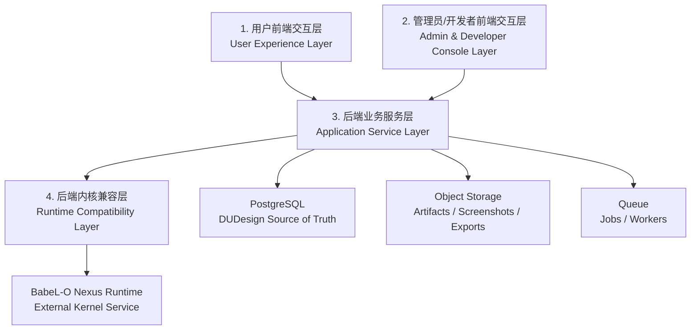

# DUDesign 四层架构治理规划

> 版本：v0.1
> 日期：2026-06-26
> 关联文档：`docs/online-design-platform-plan.md`
> 定位：定义 DUDesign 从 MVP 到线上化阶段的架构边界、依赖规则、治理机制与推进路线

## 1. 治理目标

DUDesign 的核心架构挑战不是单纯“把前端和后端拆开”，而是要在产品体验、管理治理、业务事实和 BabeL-O 内核之间建立稳定边界。BabeL-O 会持续演进，DUDesign 也会从 MVP 走向多人协作、计费、权限和企业化部署；如果一开始没有分层治理，后续会很容易出现前端直连 runtime、业务表绑定 runtime id、管理端绕过业务逻辑、BabeL-O 协议漂移影响线上用户等问题。

本规划把 DUDesign 明确定义为四层治理架构：

1. 用户前端交互层。
2. 管理员/开发者前端交互层。
3. 后端业务服务层。
4. 后端内核兼容层。

这四层不是按代码目录粗暴切分，而是按职责、权限、协议和变更频率切分。治理目标是：

- 用户端体验可以快速迭代，但不接触内核复杂性。
- 管理端可以观测和治理系统，但不是绕过业务规则的后门。
- 后端业务服务层成为 DUDesign 的唯一业务事实来源。
- BabeL-O 内核变化被隔离在兼容层，不扩散到前端和业务核心。
- 所有跨层通信都有稳定契约、测试和审计。

## 2. 四层架构总览



### 2.1 依赖方向

所有依赖必须单向流动：

```text
用户前端 / 管理端前端
  -> 后端业务服务层
  -> 后端内核兼容层
  -> BabeL-O Nexus Runtime
```

允许：

- 前端调用 DUDesign API。
- 业务服务层调用 Runtime Gateway。
- Runtime Gateway 调用 BabeL-O。
- 管理端通过 Admin API 触发取消、重试、查看健康状态等治理动作。

禁止：

- 用户前端直连 BabeL-O。
- 管理端直接调用 BabeL-O 修改 runtime 状态。
- 后端业务服务层 import BabeL-O 源码或直接依赖 BabeL-O 内部类型。
- 前端以 `NexusEvent` 作为 UI 状态模型。
- 数据库把 BabeL-O session id / agent job id 当作业务主键。

## 3. 第一层：用户前端交互层

用户前端交互层面向最终用户，负责产品体验和交互效率，不负责系统事实。

### 3.1 职责范围

- 登录后的设计工作台。
- 会话列表与会话恢复。
- 新建 HTML / 基于已有 HTML 的入口选择。
- prompt 输入与上下文附件。
- 变体数量和模板风格要求选择。
- 并行生成进度展示。
- 多变体结果墙。
- 单变体预览和精修。
- 圈画批改。
- 桌面、平板、手机尺寸预览。
- HTML 导出和分享入口。

### 3.2 状态边界

用户前端只能持有 UI 派生状态：

- 当前打开的面板。
- 输入框草稿。
- 本地未提交批注。
- 预览缩放比例。
- 当前设备尺寸。
- 临时 loading 状态。

权威状态必须来自后端：

- session。
- messages。
- jobs。
- variations。
- artifacts。
- shares。
- memory hits。
- runtime status。

### 3.3 协议边界

用户前端只消费 DUDesign 标准协议。例如：

```ts
type DesignClientEvent =
  | { type: 'design.job_started'; jobId: string }
  | { type: 'design.variation_streaming'; variationId: string; delta: string }
  | { type: 'design.variation_artifact_updated'; variationId: string; artifactId: string }
  | { type: 'design.variation_preview_ready'; variationId: string; previewUrl: string }
  | { type: 'design.variation_completed'; variationId: string }
  | { type: 'design.variation_failed'; variationId: string; errorCode: string; message: string }
  | { type: 'design.permission_required'; requestId: string; message: string }
  | { type: 'design.runtime_warning'; severity: 'info' | 'warn' | 'error'; message: string }
```

用户前端不应该直接处理这些 BabeL-O 原始事件：

```text
assistant_delta
thinking_delta
workspace_dirty
workspace_dirty_detected
tool_started
tool_completed
permission_request
result
error
```

这些事件属于内核兼容层的输入，不属于用户前端的稳定模型。

### 3.4 治理规则

- 前端 API client 必须集中封装，不允许组件散落 `fetch('/api/...')`。
- job stream 必须通过统一 `DesignEventClient` 消费。
- iframe 预览必须使用 sandbox。
- 圈画批注必须使用归一化坐标，不绑定具体像素尺寸。
- 用户前端不得展示未脱敏的 runtime 内部错误堆栈。

## 4. 第二层：管理员/开发者前端交互层

管理员/开发者前端是系统治理入口，面向运营、管理员、研发和排障人员。它与用户前端同属前端，但目标、权限、数据密度和风险完全不同，因此必须独立治理。

### 4.1 职责范围

- 用户、workspace、session、job 查询。
- design job 状态观测。
- variation 失败原因排查。
- runtime health 查看。
- runtime contract 版本查看。
- BabeL-O adapter drift 报警查看。
- 队列积压、worker 状态和任务耗时查看。
- 任务取消、重试、重新生成预览。
- artifact 审计和修复。
- token、成本、调用量统计。
- memory 命中、候选、审批状态观察。
- share revoke。
- staging / production runtime 版本切换记录。

### 4.2 权限分级

建议最少拆成三类角色：

| 角色 | 能力 |
| --- | --- |
| support | 只读查看用户 job/session 状态，不能读取敏感 HTML 全文 |
| operator | 可取消/重试 job、rebuild preview、revoke share |
| developer | 可查看 runtime contract、adapter drift、debug event、worker 详情 |

后续企业化可增加 `admin`、`billing_admin`、`security_admin`。

### 4.3 治理规则

- 管理端必须走 Admin API，不允许直连数据库、队列或 BabeL-O。
- 所有写操作必须写审计日志。
- 管理端展示用户内容时默认脱敏，查看全文需要更高权限和审计原因。
- runtime 切换、adapter 配置变更、任务批量重试必须记录操作者。
- 管理端错误信息可以比用户端详细，但仍不能泄漏密钥、内部路径和敏感 env。

### 4.4 管理端模块建议

- `Job Monitor`：队列、job、variation 状态。
- `Runtime Health`：BabeL-O 实例、Gateway、contract 版本。
- `Artifact Explorer`：artifact、截图、导出包。
- `User Support`：用户会话查询与恢复辅助。
- `Cost Dashboard`：token、成本、模型调用。
- `Memory Governance`：memory namespace、候选、命中情况。
- `Audit Log`：管理操作审计。

## 5. 第三层：后端业务服务层

后端业务服务层是 DUDesign 的业务事实来源。它负责系统逻辑、权限、持久化和对前端的稳定 API。

### 5.1 职责范围

- 用户账号和鉴权。
- workspace 管理。
- workspace 成员与团队字段预留。
- session 管理。
- session message 持久化。
- design job 生命周期。
- design variation 生命周期。
- artifact 版本管理。
- 预览、导出、分享。
- 队列调度。
- 用量统计。
- memory namespace 管理。
- 前端 API 和事件流。
- 管理端 API 和审计。

### 5.2 业务事实原则

后端业务服务层必须保存足够的稳定快照，使系统在 BabeL-O 不可用时仍可读取和展示已完成结果。

每次生成或精修至少保存：

- 用户 prompt。
- session message。
- job 和 variation 状态。
- runtime session 外部引用。
- artifact id、版本、hash、storage key。
- preview URL 或截图引用。
- token/cost/time。
- 错误摘要。

### 5.3 ID 治理

DUDesign 自身 id 是业务主键：

- `sessions.id`
- `design_jobs.id`
- `design_variations.id`
- `artifacts.id`
- `shares.id`

BabeL-O id 只能作为外部引用：

- `sessions.runtime_session_id`
- `design_variations.runtime_child_session_id`
- `design_variations.runtime_agent_job_id`

禁止用 BabeL-O id 作为 DUDesign URL 主键或数据库主键。

### 5.4 API 治理

后端业务服务层对前端提供两组 API：

- User API：面向用户前端。
- Admin API：面向管理端。

两组 API 可以复用 service，但 controller、权限和响应字段应分开。User API 默认隐藏系统内部细节，Admin API 可以返回更多诊断字段。

### 5.5 事件治理

业务服务层对前端输出 DUDesign 标准事件，不透传内核事件。事件应满足：

- 可版本化。
- 可回放。
- 可用于 UI 恢复。
- 不包含敏感 runtime 原始输入输出，除非明确是用户可见内容。
- 每个事件可以追踪到 job、variation 或 session。

## 6. 第四层：后端内核兼容层

后端内核兼容层是 BabeL-O 的防腐层，建议命名为 `Design Runtime Gateway` 或 `Runtime Compatibility Layer`。这是唯一允许理解 BabeL-O 协议细节的地方。

### 6.1 职责范围

- 连接 BabeL-O `/v1/stream`。
- 连接 BabeL-O `/v1/sessions`。
- 连接 BabeL-O `/v1/agents`。
- 处理 session resume。
- 处理子 session / child agent。
- 适配 memory 接口。
- 把 `NexusEvent` 转换为 DUDesign 标准事件。
- 维护 runtime contract manifest。
- 做版本协商和 capability 检测。
- 做兼容性降级。
- 维护 golden event replay 测试。
- 处理 runtime 不可用、超时、协议漂移。

### 6.2 对业务层暴露的接口

兼容层应暴露 DUDesign 自己的稳定接口：

```ts
type RuntimeGateway = {
  getRuntimeHealth(): Promise<RuntimeHealth>
  getRuntimeContract(): Promise<RuntimeContract>
  createSession(input: CreateRuntimeSessionInput): Promise<RuntimeSessionRef>
  resumeSession(input: ResumeRuntimeSessionInput): Promise<RuntimeResumeResult>
  spawnVariationAgents(input: SpawnVariationAgentsInput): AsyncIterable<DesignRuntimeEvent>
  refineVariation(input: RefineVariationInput): AsyncIterable<DesignRuntimeEvent>
  cancelRuntimeJob(input: CancelRuntimeJobInput): Promise<CancelRuntimeJobResult>
}
```

业务层不应该看到 `NexusEvent`，只应该看到 `DesignRuntimeEvent`。

### 6.3 Contract Manifest

每个 runtime 版本必须有 contract manifest：

```json
{
  "runtime": "babel-o",
  "runtimeVersion": "0.3.x",
  "contractVersion": "2026-06-26.dudesign.v1",
  "status": "compatible",
  "requiredEndpoints": [
    "POST /v1/sessions",
    "POST /v1/sessions/:sessionId/resume",
    "GET /v1/stream",
    "POST /v1/agents",
    "GET /v1/agents/:jobId",
    "POST /v1/agents/:jobId/wait"
  ],
  "requiredEvents": [
    "session_started",
    "assistant_delta",
    "tool_started",
    "tool_completed",
    "workspace_dirty",
    "workspace_dirty_detected",
    "result",
    "error"
  ],
  "eventMappings": {
    "assistant_delta": "design.variation_streaming",
    "workspace_dirty": "design.variation_artifact_updated",
    "result": "design.variation_completed",
    "error": "design.variation_failed"
  }
}
```

### 6.4 兼容策略

| Drift 类型 | 处理 |
| --- | --- |
| 新增可选字段 | 允许，记录 info |
| 缺失可选字段 | 允许，使用默认值 |
| 新增未知事件 | 忽略或记录 debug |
| 必需字段类型变化 | 阻断当前 runtime 版本 |
| 必需端点缺失 | 阻断当前 runtime 版本 |
| result/error 语义变化 | 阻断并要求人工适配 |
| permission 协议变化 | 阻断并进入兼容开发 |

### 6.5 升级流程

1. 在 staging 部署新 BabeL-O runtime。
2. 兼容层读取 runtime health 和 contract。
3. 跑 contract tests。
4. 跑 golden event replay。
5. 跑 3 variation 并行生成 smoke test。
6. 跑 6 variation 并行生成 smoke test。
7. 跑 session resume smoke test。
8. 跑 refine variation smoke test。
9. 管理端展示兼容结果。
10. 灰度切换 runtime pool。
11. 观察错误率、超时率、drift 报警。
12. 通过后提升为默认 runtime。

## 7. 跨层契约治理

### 7.1 API Contract

User API 和 Admin API 都需要 OpenAPI 或等价 schema。每次 API 变更必须声明：

- 是否兼容旧前端。
- 是否新增字段。
- 是否删除字段。
- 是否改变错误码。
- 是否影响权限。

### 7.2 Event Contract

DUDesign 标准事件需要独立版本：

```ts
type DesignEventEnvelope = {
  schemaVersion: '2026-06-26.dudesign-event.v1'
  type: string
  sessionId?: string
  jobId?: string
  variationId?: string
  timestamp: string
  payload: Record<string, unknown>
}
```

事件治理规则：

- 新增事件允许。
- 新增可选字段允许。
- 删除字段必须升 major version。
- 改变字段类型必须升 major version。
- 前端必须有 unknown event fallback。

### 7.3 Data Contract

数据库迁移需要遵循：

- 先加字段，再读写双兼容，最后删除旧字段。
- 关键状态字段必须有枚举约束或应用层校验。
- 外部 runtime id 字段必须命名为 `runtime_*`，避免误认为业务 id。
- 所有跨用户资源表必须包含 owner 或可追溯 owner 的关联。

### 7.4 Runtime Contract

Runtime contract 由兼容层维护，不扩散到前端。业务层只读取抽象状态：

- compatible。
- degraded。
- unavailable。
- contract_mismatch。

## 8. 代码组织建议

模块级推进文档见 `docs/modules/README.md`。每个架构层都维护独立 `TODO.md` 和 `WORKLOG.md`，用于记录待办、验收标准、工作历史和风险。

MVP 可以先单仓组织，但要保持模块边界：

```text
apps/
  web/                 # 用户前端
  admin/               # 管理端前端
  api/                 # 后端业务 API

packages/
  contracts/           # DUDesign API/event 共享类型
  domain/              # 业务实体和领域服务
  runtime-gateway/     # Runtime Compatibility Layer
  artifact-store/      # artifact 存储抽象
  auth/                # 鉴权与权限
  observability/       # 日志、指标、审计
```

如果暂时只创建一个 Next.js 应用，也要在目录上保留边界：

```text
src/
  app/                 # 用户前端路由
  admin/               # 管理端路由
  server/
    api/               # controllers
    domain/            # business services
    runtime-gateway/   # BabeL-O adapter only here
    persistence/       # db repositories
    artifacts/         # artifact storage
```

## 9. 架构规则清单

### 9.1 必须遵守

- 前端只调用 DUDesign API。
- 前端只消费 DUDesign 标准事件。
- 业务服务层是业务事实来源。
- 兼容层是唯一 BabeL-O 协议消费者。
- Runtime id 只能是 external reference。
- 所有管理端写操作必须审计。
- 所有 artifact 访问必须做 owner/share 校验。
- 所有 workspace 文件访问必须限制在 hosted root 内。
- BabeL-O 升级必须跑兼容测试。

### 9.2 明确禁止

- 用户前端直连 BabeL-O WebSocket。
- 管理端绕过 API 直接操作 runtime。
- 业务层 import BabeL-O 源码。
- 在 UI 组件中判断 `NexusEvent.type`。
- 把 runtime session id 放进用户可见 URL 作为主 id。
- 在日志中默认记录完整 HTML 内容。
- 在 share 页面暴露编辑 API。

## 10. 推进路线

### Phase G0：治理基线

- 建立本架构治理文档。
- 在产品规划中引用治理文档。
- 确认四层命名。
- 确认禁止项和依赖方向。

验收：团队评审通过，后续代码结构按四层拆分。

### Phase G1：契约先行

- 定义 User API 初版 schema。
- 定义 Admin API 初版 schema。
- 定义 DUDesign event envelope。
- 定义 Runtime Gateway interface。
- 定义 runtime contract manifest。

验收：前端和后端可以基于 mock contract 并行开发。

### Phase G2：业务事实层落地

- 创建用户、workspace、session、job、variation、artifact、share 数据模型。
- 实现业务 service。
- 实现 owner 权限校验。
- 实现审计日志基础表。

验收：不依赖 BabeL-O 也能创建会话、保存 artifact、读取历史。

### Phase G3：Runtime Gateway 落地

- 实现 BabeL-O Adapter。
- 实现 NexusEvent -> DesignRuntimeEvent 映射。
- 实现 create/resume/spawn/refine。
- 实现 runtime unavailable 和 contract mismatch 降级。

验收：业务层可以通过 Gateway 完成单 variation 生成。

### Phase G4：管理端治理能力

- Runtime health 页面。
- Job monitor 页面。
- Adapter drift 页面。
- Queue monitor 页面。
- Audit log 页面。

验收：开发者可以在管理端定位一次 job 失败来自业务、队列、artifact 还是 runtime。

### Phase G5：升级治理

- golden event replay。
- contract tests。
- runtime smoke tests。
- staging runtime pool。
- 灰度和回滚操作记录。

验收：BabeL-O 升级不需要改用户前端和业务核心。

## 11. 架构决策记录

### ADR-001：采用四层治理架构

决策：DUDesign 采用用户前端、管理端前端、后端业务服务层、后端内核兼容层四层架构。

原因：

- 用户体验和系统治理的前端目标不同。
- 业务事实必须独立于 BabeL-O runtime。
- BabeL-O 持续演进，需要防腐层隔离。
- 管理端高权限操作必须独立审计。

### ADR-002：前端不直接消费 NexusEvent

决策：前端只消费 DUDesign 标准事件。

原因：

- 降低 BabeL-O 协议漂移对 UI 的影响。
- 让用户端和管理端共享稳定事件模型。
- 便于回放、测试和降级。

### ADR-003：BabeL-O id 只作为外部引用

决策：所有业务 URL 和数据库主键使用 DUDesign id，BabeL-O id 仅作为 `runtime_*` 外部引用字段。

原因：

- 保证历史数据在 runtime 迁移、重建、降级后仍可访问。
- 避免业务逻辑绑定内核实现。

### ADR-004：管理端不是后门

决策：管理端所有操作必须经过 Admin API 和业务权限校验。

原因：

- 防止排障工具变成不受控的数据修改入口。
- 支持审计、回滚和责任追踪。

## 12. 待确认事项

- 管理端是否与用户端共用同一个 Next.js app，还是独立 app。
- Admin API 的首批角色模型。
- Runtime Gateway 是内嵌在 API 服务中，还是独立 service。
- BabeL-O runtime 是单池共享，还是按租户/用户隔离池。
- runtime contract manifest 由 BabeL-O 提供，还是 DUDesign 自己维护。
- 首批架构规则是否要用 lint/import boundary 工具强制。
