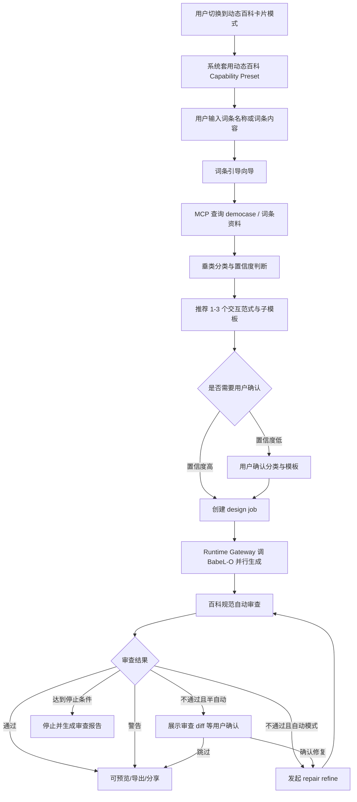

# DUDesign 动态百科卡片业务逻辑规划

> 版本：v0.1
> 日期：2026-07-03
> 文档类型：业务逻辑规划
> 状态：规划准入
> 适用对象：产品、业务负责人、前端、后端、Runtime Gateway、运营治理
> 关联文档：
> - `docs/weekly-feature-roadmap.md`
> - `docs/online-design-platform-plan.md`
> - `docs/architecture-governance-plan.md`
> - `docs/modules/README.md`
> - `docs/modules/capability-distribution/README.md`
> - `docs/modules/capability-distribution/templates.md`
> - `docs/modules/capability-distribution/plugins.md`
> - `docs/modules/capability-distribution/automation-loop.md`

---

## 1. 文档目的

本文档用于把“动态百科卡片”从一个产品想法收敛为可进入 DUDesign 文档库和四层架构推进的业务逻辑规划。

它回答五个问题：

1. 动态百科卡片与当前 Web&App 生成能力是什么关系；
2. 用户输入“词条”后，系统应如何完成分类、模板匹配、生成和审查；
3. “词条引导插件”“动态百科词条卡片模板包”“自动审查”分别落在哪个架构边界；
4. 哪些能力可以复用当前系统，哪些必须新建；
5. 后续实现应按什么顺序推进，避免把业务编排错误地塞进 Runtime 兼容层。

本文不是实现记录。进入开发后，具体任务必须同步落到 `docs/modules/*/TODO.md`，完成后同步 `WORKLOG.md`。

---

## 2. 总体判断

动态百科卡片业务线是合理的，并且与 DUDesign 当前底座高度契合。

当前系统已经具备：

- Design Template Pack。
- 官方/用户模板库。
- Capability Plugin / Design Skill / MCP Tool Binding。
- Automation Loop。
- Runtime Gateway / BabeL-O Adapter。
- 并行 variation 生成。
- artifact、preview、export、share。
- 用户偏好与 capability snapshot。

因此动态百科卡片不需要另建一套系统。它应作为一个垂直业务 `Product Mode + Capability Preset + Business Wizard` 接入现有四层架构。

但原始设想中有几处需要修正：

| 原始表述 | 修正后规划 |
| --- | --- |
| 将“全新 HTML / 基于现有 HTML”替换为“Web&App / 动态百科卡片” | 不直接替换。`sourceMode` 表达输入来源，`productMode` 表达产物形态，两者正交 |
| “词条引导”是一个插件 | 对用户可表现为一个插件，对系统应拆为 MCP 查询、声明式 skill、API 编排向导 |
| 自动匹配“动态百科词条卡片模板包中的子模板” | 需要先把父模板包、子模板、交互范式分层建模 |
| “自动审查”是一套新 loop | 复用现有 Automation Loop，新增百科规范审查器、review profile 和半自动控制流 |
| Babel-O 兼容层处理全部调用 | Runtime 兼容层只负责 prompt/tool policy/事件适配；分类、匹配、审查状态机属于业务服务层 |

---

## 3. 核心业务流程

动态百科卡片模式下，用户的主任务不是泛化页面需求，而是输入一个“百科词条”并获得可交付的动态百科卡片 HTML。



---

## 4. 产品模式与输入来源

### 4.1 不替换 Source Mode

当前 `sourceMode` 的语义是输入来源：

- `new_html`：从零生成。
- `from_existing_html`：基于已有 HTML artifact 继续修改。

动态百科卡片的语义是产物形态，不应覆盖输入来源。否则会丢掉“基于已有动态百科卡片继续修改”的能力。

### 4.2 新增 Product Mode

建议新增独立产品模式：

```ts
type ProductMode = 'web_app' | 'dynamic_encyclopedia_card'
```

二者组合示例：

| productMode | sourceMode | 用户语义 |
| --- | --- | --- |
| `web_app` | `new_html` | 创建一个新的 Web 页面或 App 页面 |
| `web_app` | `from_existing_html` | 基于已有网页继续改 |
| `dynamic_encyclopedia_card` | `new_html` | 根据词条创建一张新的动态百科卡片 |
| `dynamic_encyclopedia_card` | `from_existing_html` | 基于已有百科卡片继续改 |

### 4.3 动态百科 Preset

当用户切换到 `dynamic_encyclopedia_card` 时，系统默认套用一个能力预设：

```json
{
  "productMode": "dynamic_encyclopedia_card",
  "presetId": "preset_dynamic_encyclopedia_card",
  "capabilityRequirements": {
    "template": {
      "designTemplatePackIds": ["dtp_dynamic_encyclopedia_card"],
      "autoDistributeTemplatePacks": true
    },
    "plugins": {
      "skillIds": ["sk_encyclopedia_entry_guidance"],
      "mcpToolIds": ["mcp_encyclopedia_democase_readonly"]
    },
    "automation": {
      "loopProfileId": "loop_encyclopedia_spec_review"
    }
  }
}
```

用户端可以显示为自动勾选：

- 词条引导。
- 动态百科词条卡片模板包。
- 自动审查。

这些默认勾选应可撤销。撤销后仍要在 job snapshot 中记录用户最终选择。

---

## 5. 词条引导能力拆分

“词条引导”对用户可以是一个整体能力，但系统内部不应把它做成单个插件。它实际包含三类能力。

| 子能力 | 形态 | 所属边界 | 说明 |
| --- | --- | --- | --- |
| democase 查询 | MCP Tool Binding | Capability Distribution + Runtime Compatibility | 只读连接词条 democase 数据库或服务 |
| 垂类分类与模板匹配规则 | Design Skill | Capability Distribution | 提供分类标准、匹配方法、质量 checklist |
| 词条引导向导 | Application Service 编排 | 后端业务服务层 | 负责输入词条、查询资料、分类、推荐模板、保存结果 |

### 5.1 MCP Tool：democase 只读查询

建议定义只读 MCP：

```ts
type EncyclopediaDemocaseLookupInput = {
  entryTitle: string
  entryContent?: string
  locale?: 'zh-CN'
  maxCases?: number
}
```

```ts
type EncyclopediaDemocaseLookupResult = {
  cases: Array<{
    id: string
    title: string
    l1: string
    l2: string
    l3?: string
    interactionParadigms: string[]
    templateIds: string[]
    summary: string
    confidenceHint?: number
  }>
  source: 'democase'
  retrievedAt: string
}
```

治理要求：

- 只读。
- 不写入用户 memory。
- 结果进入 prompt 前必须标注来源。
- MCP 不允许直接访问 DUDesign 用户私有数据。
- MCP 不直接被前端调用，必须经过 Application Service 或 Runtime Gateway 的工具策略。

### 5.2 Skill：百科词条分类与匹配规则

建议新增官方 safe skill：

```text
sk_encyclopedia_entry_guidance
```

它负责声明规则，不负责执行查询或写库。

规则来源：

- `/Users/tangyaoyue/DEV/Baidu/KeDU-动态百科服务平台/动态百科服务平台_完整分类体系.md`
- DUDesign 官方动态百科模板库。
- 管理端后续维护的分类、子模板、审查规范。

Skill 应包含：

- L1/L2/L3 分类方法。
- 低置信度时必须请求用户确认。
- 推荐 1-3 个候选模板时必须给出理由。
- 不得编造事实。
- 不得把 democase 结果当成用户词条事实来源。
- 生成时必须遵守动态百科卡片固定 viewport 和 iframe 约束。

### 5.3 API 编排：词条引导向导

建议新增后端编排能力，而不是把分类和匹配完全塞进 prompt。

```text
POST /api/encyclopedia/entry-guidance
```

请求：

```json
{
  "workspaceId": "ws_xxx",
  "entryTitle": "李白",
  "entryContent": "可选词条正文或资料",
  "variationCount": 3,
  "mode": "auto"
}
```

响应：

```json
{
  "guidanceId": "eg_xxx",
  "classification": {
    "l1": "名人",
    "l2": "历史人物",
    "l3": "其他",
    "confidence": 0.82,
    "reasons": ["词条主体为历史人物", "资料包含生卒年、作品、经历"]
  },
  "recommendations": [
    {
      "interactionParadigmId": "timeline_story",
      "templatePackId": "dtp_dynamic_encyclopedia_timeline_card",
      "confidence": 0.78,
      "reason": "人物经历适合时间线叙事"
    }
  ],
  "requiresConfirmation": false
}
```

`guidanceId` 应写入后续 `design_job.templateRequirements` 或扩展后的 business context，保证 resume、审查、管理端排查可追溯。

---

## 6. 模板包、子模板与交互范式

动态百科业务里至少有三层概念，不能混在一个“模板”字段里。

| 概念 | 负责什么 | 示例 |
| --- | --- | --- |
| 父模板包 | 动态百科统一视觉、尺寸、iframe、交付约束 | `dtp_dynamic_encyclopedia_card` |
| 子模板 | 具体页面结构和卡片布局 | 摘要卡、时间线卡、关系图卡、对比卡、问答卡 |
| 交互范式 | 内容如何被探索和理解 | 时间线叙事、热区探索、思维导图、问答闯关 |

### 6.1 父模板包

当前已有 `dtp_dynamic_encyclopedia_card`，它适合作为父级能力包，约束：

- PC 卡片尺寸。
- 移动端尺寸。
- iframe 嵌入行为。
- touch / scroll 行为。
- 视觉基调和不允许项。

### 6.2 子模板

当前 `DesignTemplatePack` 尚未结构化表达父子关系。建议新增字段：

```ts
type DesignTemplatePack = {
  parentPackId?: string | null
  templateRole?: 'parent_pack' | 'child_template'
  supportedProductModes?: ProductMode[]
  supportedEntryCategories?: string[]
  supportedInteractionParadigms?: string[]
}
```

首批建议子模板：

| 子模板 ID | 适用内容 | 推荐垂类 |
| --- | --- | --- |
| `dtp_dynamic_encyclopedia_summary_card` | 核心事实、摘要、关键指标 | 企业、学校、产品、机构 |
| `dtp_dynamic_encyclopedia_timeline_card` | 经历、历史、阶段演进 | 历史人物、影视作品、企业发展 |
| `dtp_dynamic_encyclopedia_relation_card` | 人物关系、作品关系、组织关系 | 名人、影视、文学、机构 |
| `dtp_dynamic_encyclopedia_compare_card` | 参数、版本、差异对比 | 产品、游戏、城市、疾病科普 |
| `dtp_dynamic_encyclopedia_explore_card` | 热区探索、地图、空间探索 | 地域建筑、景区、自然地理 |

### 6.3 交互范式

交互范式建议作为单独的业务字段，而不是塞进 `DesignTemplatePack`。

```ts
type InteractionParadigm = {
  id: string
  name: string
  category: string
  bestFor: string[]
  avoidFor: string[]
  requiredDataShape: string[]
  compatibleTemplatePackIds: string[]
}
```

词条引导向导输出应包含：

- 分类结果。
- 子模板推荐。
- 交互范式推荐。
- 推荐理由。
- 置信度。
- 是否需要用户确认。

---

## 7. 自动审查与修复

动态百科的“自动审查”不应另建 loop 引擎。它应复用当前 Automation Loop，并新增百科规范审查能力。

### 7.1 新增 Loop Profile

建议新增：

```text
loop_encyclopedia_spec_review
```

它不是单纯“修复力度”，而是动态百科业务的审查 profile。

建议默认值：

| 字段 | 建议 |
| --- | --- |
| `maxRepairAttempts` | 2 |
| `maxDurationMs` | 720000 |
| `maxCostCents` | 500 |
| `qualityGate` | `spec` 或扩展为 `static+spec` |
| `enablePixelGate` | true，后续可由 worker 异步执行 |
| `repairStrategy` | `spec_review_refine` |

### 7.2 新增百科规范审查器

审查器属于后端业务服务层，不属于 Runtime 兼容层。

它应检查：

- HTML 完整性：doctype、viewport、title、完整 body。
- 固定尺寸：PC 与移动端尺寸满足动态百科卡片规范。
- 嵌入安全：不得依赖外部脚本、绝对路径或不可控网络资产。
- iframe 行为：滚动、touch、overflow 不破坏宿主页面。
- 内容结构：必备章节与词条分类匹配。
- 语气规范：中立、百科化，避免营销腔、绝对化宣传。
- 模板一致性：必须符合选中子模板与交互范式。
- 响应式：指定卡片尺寸下文字不溢出、不遮挡。

审查输出：

```ts
type EncyclopediaSpecReviewResult = {
  status: 'pass' | 'warn' | 'fail'
  artifactId: string
  templatePackId: string
  childTemplateId?: string
  interactionParadigmId?: string
  findings: Array<{
    code: string
    severity: 'warning' | 'error'
    message: string
    repairHint?: string
    source: 'static_rule' | 'template_rule' | 'pixel_gate' | 'llm_review'
  }>
}
```

### 7.3 自动 / 半自动 / 关闭

“自动审查”的开启方式应与 loop profile 分开。

```ts
type ReviewMode = 'off' | 'semi_auto' | 'auto'
```

| 模式 | 行为 |
| --- | --- |
| `off` | 不跑百科规范审查，只保留通用 artifact quality gate |
| `semi_auto` | 审查后暂停，展示 diff 和修复 prompt 预览，由用户确认后 refine |
| `auto` | 审查失败时自动发起 refine，直到通过或达到停止条件 |

半自动是新增控制流，需要：

- 后端 job/variation 状态支持 `review_pending_confirmation`。
- 前端展示审查报告与“确认修复 / 跳过 / 手动修改”。
- 确认后调用 repair refine。
- 所有审查报告和确认动作写入 audit / event。

---

## 8. 四层架构落点

### 8.1 用户前端交互层

负责：

- 增加 `Web&App / 动态百科卡片` 产品模式切换。
- 保留“新建 / 基于已有 HTML”的输入来源能力。
- 动态百科模式下展示词条输入框。
- 自动勾选并展示三件套：
  - 词条引导。
  - 动态百科词条卡片模板包。
  - 自动审查。
- 展示分类结果、候选模板和推荐理由。
- 低置信度时允许用户确认或改选分类/子模板。
- 展示自动审查报告。
- 半自动模式下支持确认修复。

不负责：

- 直接调用 democase 数据库。
- 直接拼接 BabeL-O prompt。
- 在浏览器端执行规范审查事实判断。

### 8.2 管理员/开发者前端交互层

负责：

- 管理动态百科父模板包和子模板。
- 管理 L1/L2/L3 分类映射。
- 管理交互范式。
- 管理 democase MCP 可用性和权限。
- 管理百科规范审查规则。
- 查看分类置信度分布、模板命中率、审查失败原因、自动修复成功率。
- 支持禁用风险子模板、插件或审查规则。

### 8.3 后端业务服务层

负责：

- 新增 `productMode` / business context。
- 新增词条引导向导 API。
- 保存分类结果、推荐结果、用户确认结果。
- 将推荐子模板映射到 variation assignments。
- 新增百科规范审查器。
- 编排自动 / 半自动 / 关闭三种审查模式。
- 生成审查报告和 repair prompt。
- 将所有能力选择写入 immutable job snapshot。

### 8.4 后端内核兼容层

负责：

- 把词条引导 skill 编译为受控 prompt block。
- 把 democase MCP binding 编译为 tool policy。
- 把父模板包、子模板、交互范式和审查上下文编译为 BabeL-O 可消费的标准上下文。
- 将 BabeL-O 原始事件归一化为 DUDesign 标准事件。
- 对 runtime unavailable / contract drift 给出标准降级事件。

不负责：

- 分类决策的业务状态机。
- 模板推荐的数据库写入。
- 审查报告事实来源存储。
- 半自动等待用户确认的控制流。

---

## 9. 数据模型草案

### 9.1 Product Mode

```ts
type ProductMode = 'web_app' | 'dynamic_encyclopedia_card'
```

建议加入：

- `design_jobs.product_mode`
- 或 `design_jobs.template_requirements.productMode`

短期可先进入 `templateRequirements`，中期再 SQL 字段化。

### 9.2 Encyclopedia Guidance

```ts
type EncyclopediaEntryGuidance = {
  id: string
  userId: string
  workspaceId: string
  sessionId?: string
  entryTitle: string
  entryContentHash?: string
  classification: {
    l1: string
    l2: string
    l3?: string
    confidence: number
    reasons: string[]
  }
  recommendations: Array<{
    interactionParadigmId: string
    templatePackId: string
    confidence: number
    reason: string
  }>
  democaseRefs: string[]
  status: 'draft' | 'confirmed' | 'used' | 'superseded'
  createdAt: string
  updatedAt: string
}
```

### 9.3 Review Report

```ts
type EncyclopediaSpecReviewReport = {
  id: string
  jobId: string
  variationId: string
  artifactId: string
  attempt: number
  reviewMode: 'off' | 'semi_auto' | 'auto'
  status: 'pass' | 'warn' | 'fail'
  findings: EncyclopediaSpecReviewResult['findings']
  repairPromptHash?: string
  userDecision?: 'accepted_repair' | 'skipped' | 'manual_refine'
  createdAt: string
}
```

---

## 10. API 草案

### 10.1 词条引导

```text
POST /api/encyclopedia/entry-guidance
GET /api/encyclopedia/entry-guidance/:id
POST /api/encyclopedia/entry-guidance/:id/confirm
```

### 10.2 创建任务扩展

`POST /api/design-jobs` 增加：

```json
{
  "productMode": "dynamic_encyclopedia_card",
  "sourceMode": "new_html",
  "businessContext": {
    "type": "encyclopedia_entry",
    "guidanceId": "eg_xxx",
    "entryTitle": "李白",
    "classification": {
      "l1": "名人",
      "l2": "历史人物"
    },
    "reviewMode": "auto"
  }
}
```

### 10.3 审查与半自动确认

```text
GET /api/variations/:id/spec-review
POST /api/variations/:id/spec-review/repair
POST /api/variations/:id/spec-review/skip
```

---

## 11. 与 BabeL-O 的交互边界

BabeL-O 仍作为生成与 refine 的运行时内核。DUDesign 通过 Runtime Gateway 给它提供标准上下文。

建议 Gateway prompt context 分层：

```text
1. User task
2. Product mode context: dynamic encyclopedia card
3. Entry classification context
4. Democase references summary
5. Parent template pack directives
6. Child template directives
7. Interaction paradigm directives
8. Skill prompt block
9. Tool policy
10. Review / repair context
11. Runtime guardrails
```

禁止：

- 前端直接传 BabeL-O 私有 prompt。
- Babel-O 直接读 DUDesign 数据库。
- MCP 结果未经来源标注进入 memory。
- Runtime Gateway 泄露 Babel-O 原始事件给用户端。

---

## 12. MVP 推进顺序

### Stage 1：规划准入与契约补齐

- 新增本文档。
- 在四层模块 TODO 中登记动态百科业务线。
- 明确 `productMode` 不替代 `sourceMode`。
- 明确父模板包、子模板、交互范式三层模型。

### Stage 2：模板与分类骨架

- 为 `DesignTemplatePack` 增加父子关系字段。
- 注册动态百科首批子模板。
- 建立 L1/L2/L3 到子模板和交互范式的 mapping。
- 增加 mapping 单测。

### Stage 3：词条引导向导

- 注册 `sk_encyclopedia_entry_guidance`。
- 注册 `mcp_encyclopedia_democase_readonly`，初期可 mock。
- 新增 entry guidance API。
- 支持输入词条后返回分类、置信度、1-3 个模板推荐。
- API smoke 覆盖低置信度需要确认。

### Stage 4：用户端动态百科模式

- 首页增加产品模式切换。
- 动态百科模式自动勾选三件套。
- 展示推荐分类和子模板。
- 支持用户确认推荐后创建 job。
- E2E 覆盖动态百科 preset -> 推荐 -> 生成。

### Stage 5：百科规范审查

- 新增 `loop_encyclopedia_spec_review`。
- 新增 spec review checker。
- 生成完成后跑审查。
- 自动模式下最多修复 N 次。
- 半自动模式下等待用户确认。
- E2E 覆盖审查报告与确认修复。

### Stage 6：真实 MCP 与 BabeL-O 联调

- democase MCP 从 mock 升级为真实只读服务。
- Runtime Gateway golden 覆盖词条引导 skill、MCP tool policy、模板上下文注入。
- BabeL-O staging smoke 覆盖动态百科模式端到端。

### Stage 7：管理端治理

- 管理分类映射、子模板、交互范式。
- 管理审查规则与失败原因统计。
- 管理 democase MCP 健康与调用审计。
- 展示模板命中率、审查通过率、自动修复成功率。

---

## 13. 测试与验收

### Unit

- productMode/sourceMode 正交解析。
- 分类 mapping。
- 子模板选择。
- low confidence 判断。
- spec review rule checker。
- review finding serializer。
- repair prompt builder。

### API Smoke

- 输入词条创建 guidance。
- guidance 推荐 1-3 个子模板。
- 低置信度 guidance 需要确认。
- guidance confirmed 后创建 design job。
- job snapshot 固定分类、模板、交互范式和 review mode。
- 旧 job resume 不受 mapping 更新影响。

### Runtime Golden

- 词条引导 skill prompt block 稳定。
- democase MCP tool policy 稳定。
- 子模板 prompt block 稳定。
- spec repair context 稳定。
- BabeL-O event drift 不破坏 DUDesign 标准事件。

### E2E

- 切换动态百科卡片模式 -> 自动勾选三件套。
- 输入词条 -> 获得分类与模板推荐。
- 确认推荐 -> 创建 job -> 生成 variation。
- 审查失败 -> 半自动确认修复 -> 生成新 artifact。
- 自动审查通过后可 preview/export/share。

---

## 14. 风险与应对

| 风险 | 影响 | 应对 |
| --- | --- | --- |
| 直接替换 sourceMode | 丢失基于已有 HTML 修改能力 | 新增 productMode，与 sourceMode 正交 |
| 词条引导被做成单插件 | 业务编排不可测、不可追溯 | 拆为 MCP + skill + API wizard |
| 子模板没有结构化父子关系 | 无法表达“自动勾选子模板” | 扩展 DesignTemplatePack 父子字段 |
| 交互范式与模板包混淆 | 匹配结果不可解释 | 单独建模 InteractionParadigm |
| 自动审查无限循环 | 成本失控、体验变差 | 复用 stop condition，限制次数/成本/时长 |
| 半自动状态未设计 | 用户无法控制修复 | 新增 review pending confirmation 控制流 |
| BabeL-O 直接读取业务库 | 解耦失败、升级风险高 | 只通过 Gateway 标准上下文和 tool policy |

---

## 15. 文档准入结论

本业务线允许进入 DUDesign 文档库，原因：

- 它复用现有四层架构，不新增第五层。
- 它复用 Capability Distribution System，不另建模板/插件/loop 体系。
- 它明确了 Application Service 与 Runtime Compatibility 的职责边界。
- 它将动态百科业务规则沉淀为可版本化、可审计、可测试的业务契约。

准入后的首批落地要求：

- 更新 `docs/modules/capability-distribution/TODO.md`。
- 更新 `docs/modules/user-experience/TODO.md`。
- 更新 `docs/modules/application-service/TODO.md`。
- 更新 `docs/modules/runtime-compatibility/TODO.md`。
- 更新 `docs/modules/admin-console/TODO.md`。
- 在相关 `WORKLOG.md` 中记录本次规划决策。

