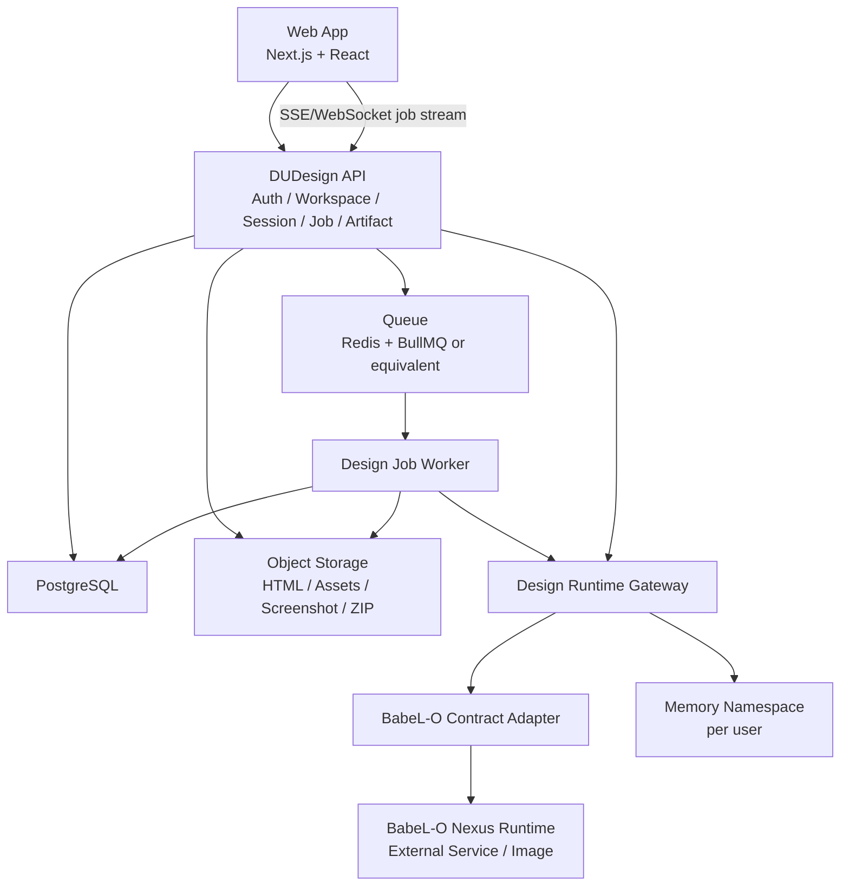
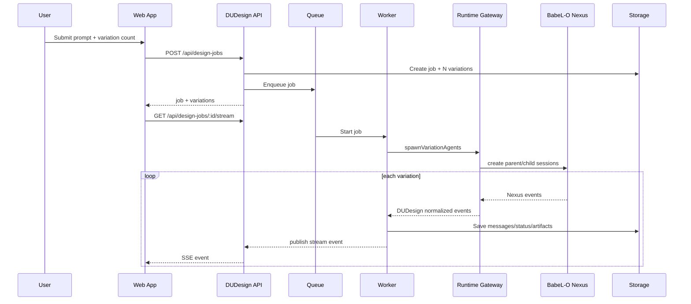

# DUDesign 在线前端设计平台项目规划

> 版本：v0.1
> 日期：2026-06-26
> 定位：以 BabeL-O 运行时为服务内核、面向线上用户的 SaaS 前端设计平台 MVP 规划
> 架构治理：见 `docs/architecture-governance-plan.md`

## 1. 项目目标

DUDesign 的目标是把 BabeL-O 的持久会话、工具执行、子 agent 并行和记忆能力包装成一个可上线的前端设计产品。用户通过浏览器登录后，可以用自然语言生成 HTML 页面，也可以基于已有 HTML 继续改造；系统根据用户选择的数量并行生成多个设计变体，完成后提供预览、单变体精修、圈画批改、多端尺寸预览、HTML 导出和分享。

MVP 的关键不是重写 BabeL-O，而是把 BabeL-O 作为独立运行时服务接入。DUDesign 自身负责用户、工作区、会话、任务、变体、资产、分享和产品级权限；BabeL-O 负责 agent loop、工具调用、session resume、子 session 编排和 memory 检索。两者之间必须通过稳定的 Design Runtime Gateway 和契约适配层解耦，避免 BabeL-O 内核自身更新直接影响线上产品。

### 1.1 成功标准

- 用户可以注册/登录，并看到自己的会话列表和工作区。
- 用户可以创建一个设计会话，选择“新建 HTML”或“基于已有 HTML 修改”。
- 用户可以设置同一需求下的变体数量，例如 2、3、4、6 个。
- 系统能并行启动对应数量的子运行时任务，并实时展示每个变体的生成状态。
- 生成完成后，用户可以在结果墙预览所有变体，并进入任一变体继续单独修改。
- 单变体页面支持 prompt 精修、圈画批改、桌面/平板/手机预览、导出 HTML 和分享链接。
- 刷新浏览器或重新登录后，用户可以恢复历史会话并继续任务。
- 每个用户拥有独立记忆命名空间，memory 只作为提示，不作为事实来源。
- BabeL-O 版本升级时，只需要调整 Gateway/Adapter 和契约测试，不要求修改产品核心业务层。

### 1.2 MVP 不做

- 不开放团队协作 UI。
- 不实现多人实时协同编辑。
- 不支持用户本地目录挂载，MVP 只支持 hosted workspace。
- 不实现完整代码 IDE，例如 Monaco 编辑器、复杂 git 操作面板。
- 不把 BabeL-O 源码 import 到 DUDesign 应用层。
- 不让前端直接消费 BabeL-O 内部事件全集。

团队协作需要在数据模型和 API 中预留字段，包括 `team_id`、workspace member、role、visibility 等，但第一版不暴露完整协作入口。

## 2. 产品流程

### 2.1 登录与工作区

用户进入 DUDesign 后先登录。登录完成进入个人工作台，默认展示：

- 最近会话列表。
- 最近设计任务。
- 创建新会话入口。
- 工作区选择器。

MVP 默认每个用户有一个个人 hosted workspace。后续团队协作上线后，workspace 可以归属于团队，但 MVP 阶段仍保留 `team_id` 字段为空。

### 2.2 创建设计会话

用户点击新建后进入交互首页。该页面参考图 1 的心智，但需要落到产品可用性：

- 输入 prompt。
- 选择模式：
  - 新建 HTML 页面。
  - 基于已有 HTML 继续开发。
- 如果选择已有 HTML，可以上传 `.html` 或选择历史 artifact。
- 选择变体数量，例如 1、2、3、4、6。
- 可选填写模板偏好，例如极简、科技、品牌官网、SaaS landing、移动端优先等。
- 点击生成后创建一次 `design_job`。

### 2.3 并行生成

生成页参考图 2。一次 `design_job` 下会创建 N 个 `design_variations`，每个 variation 绑定一个独立 BabeL-O child session。页面以网格展示：

- 变体编号。
- 运行状态：queued、running、streaming、rendering_preview、completed、failed、cancelled。
- 代码/日志流片段。
- token、耗时、成本估算。
- 错误摘要。

每个 variation 完成后可以立刻预览，不必等待全部完成。全部完成后进入结果墙。

### 2.4 结果墙

结果墙参考图 3。用户可以看到所有变体的截图或 iframe 预览卡片：

- 变体标题和编号。
- 预览截图。
- token/cost/time。
- 打开预览。
- 进入精修。
- 锁定当前版本。
- 导出。

用户点击任一变体后进入单变体编辑页。

### 2.5 单变体精修

单变体页面参考图 4，核心是“预览 + refine 面板 + 圈画批改”：

- 主区域展示 iframe 预览。
- 顶部支持设备尺寸切换：
  - Desktop：1440px 或自适应桌面宽。
  - Tablet：768px。
  - Mobile：390px。
- 右侧 refine 面板支持自然语言修改。
- 圈画批改层支持矩形、圆形、箭头、自由线和文字批注。
- 用户提交修改后，只继续该 variation 的 runtime session，不影响其他变体。
- 每次 refine 产生一个新 artifact version。
- 用户可以导出当前版本 HTML，或创建分享链接。

### 2.6 会话恢复

每个聊天会话必须可以随时重启继续任务。恢复时需要还原：

- session 基础信息。
- 历史消息。
- design job 列表。
- variations 状态和 artifact。
- 当前选中的 variation/version。
- 对应 BabeL-O runtime session id。
- memory 注入记录。

如果 BabeL-O runtime session 无法直接恢复，Gateway 必须提供降级路径：读取 DUDesign 自身的 session/message/artifact 快照，重新创建 runtime session，并把历史摘要、当前 artifact 和用户最新意图作为上下文注入。

## 3. 系统架构



### 3.1 前端

前端参考 `GODesign/bbl-design-app` 的实现方向：

- Next.js App Router。
- React + TypeScript。
- 浏览器端使用 iframe 预览 hosted artifact。
- 圈画批改使用 canvas overlay，坐标归一化到 `0..1`。
- 不直接连接 BabeL-O `/v1/stream`，而是连接 DUDesign 标准 job stream。
- 不在前端持有权威 session 状态，刷新后通过 API 重建。

主要页面：

- `/login`：登录页。
- `/app`：工作台/会话列表。
- `/app/sessions/:sessionId`：交互首页与会话详情。
- `/app/jobs/:jobId`：并行生成页。
- `/app/jobs/:jobId/results`：结果墙。
- `/app/variations/:variationId`：单变体精修页。
- `/share/:shareToken`：只读分享页。

### 3.2 DUDesign API

应用后端负责产品级资源，不负责 agent 内核实现：

- 用户账号和鉴权。
- hosted workspace 管理。
- 会话和消息持久化。
- design job 与 variation 生命周期。
- artifact 存取、版本、导出和分享。
- job stream 聚合。
- 调用 Design Runtime Gateway。
- 记录 token/cost/time 等用量数据。

### 3.3 Design Runtime Gateway

Gateway 是 DUDesign 与 BabeL-O 之间的唯一集成点。它提供 DUDesign 稳定接口：

- `createRuntimeSession(input)`
- `resumeRuntimeSession(input)`
- `spawnVariationAgents(input)`
- `streamRuntimeEvents(input)`
- `refineVariation(input)`
- `cancelJob(input)`
- `exportArtifact(input)`
- `getRuntimeContract()`

Gateway 不把 BabeL-O 的内部类型暴露给业务层。它把 `NexusEvent` 转换为 DUDesign 标准事件，例如：

- `design.session_started`
- `design.variation_queued`
- `design.variation_streaming`
- `design.variation_artifact_updated`
- `design.variation_preview_ready`
- `design.variation_completed`
- `design.variation_failed`
- `design.permission_required`
- `design.memory_hits`
- `design.runtime_warning`

业务前端只消费 DUDesign 标准事件。这样 BabeL-O 的事件字段增减、事件名新增、兼容字段变化，都被隔离在 Adapter。

### 3.4 BabeL-O Runtime Service

BabeL-O 以独立 runtime service 或容器镜像部署。DUDesign 不 import 它的源码，也不依赖其内部文件路径。可消费的外部能力包括：

- `/v1/stream`：流式执行。
- `/v1/sessions`：创建和读取 session。
- `/v1/sessions/:id/resume`：恢复 session 快照。
- `/v1/agents`：创建 child session / sub-agent。
- `/v1/sessions/:id/children`：读取子 session。
- runtime memory 相关接口。
- runtime status/config/model 信息。

如果 BabeL-O 后续提供正式 contract endpoint，Adapter 优先使用。若暂无稳定 contract endpoint，DUDesign 需要在自身仓库维护一份 runtime contract manifest，并用兼容测试约束升级。

### 3.5 Hosted Workspace

MVP 不使用用户本地 cwd。每个 workspace 都是服务器端隔离容器：

```text
workspaces/
  ws_xxx/
    files/
      index.html
      assets/
    artifacts/
      variation_xxx/
        versions/
    metadata/
```

运行时执行时，Gateway 给 BabeL-O 传入的是服务器端 workspace root。所有 path 都必须限制在 workspace root 内，禁止 `..`、symlink escape、访问其他用户目录。

## 4. BabeL-O 解耦方案

### 4.1 解耦原则

- BabeL-O 是外部运行时，不是 DUDesign 应用代码的一部分。
- DUDesign 只依赖 Gateway interface，不依赖 BabeL-O module path。
- Gateway 内部用 Adapter 适配 BabeL-O 当前版本。
- Adapter 需要有 contract manifest 和兼容测试。
- 前端只消费 DUDesign event，不消费原始 NexusEvent。
- 所有 BabeL-O runtime session id 都作为外部引用存储，不作为业务主键。

### 4.2 Runtime Contract Manifest

建议维护 `runtime_contracts` 表和一份可版本化 manifest：

```json
{
  "runtime": "babel-o",
  "runtimeVersion": "0.3.x",
  "contractVersion": "2026-06-26.dudesign.v1",
  "compatibleRuntimeVersions": ["0.3.9"],
  "requiredEndpoints": [
    "POST /v1/sessions",
    "GET /v1/sessions/:id",
    "POST /v1/sessions/:id/resume",
    "GET /v1/stream",
    "POST /v1/agents",
    "GET /v1/agents/:jobId",
    "POST /v1/agents/:jobId/wait"
  ],
  "eventMappings": {
    "session_started": "design.session_started",
    "assistant_delta": "design.variation_streaming",
    "workspace_dirty": "design.variation_artifact_updated",
    "workspace_dirty_detected": "design.variation_artifact_updated",
    "result": "design.variation_completed",
    "error": "design.variation_failed"
  }
}
```

### 4.3 升级策略

BabeL-O 升级流程必须固定：

1. 在 staging 环境启动新 runtime image。
2. Gateway 拉取或加载新 contract manifest。
3. 运行 contract tests，确认必要端点存在。
4. 运行 golden event replay，确认事件归一化输出不变。
5. 运行并行生成 smoke test，至少覆盖 3 个和 6 个 variation。
6. 运行 resume smoke test，确认旧 session 可恢复。
7. 如果 drift 只影响 Adapter 支持的可选字段，允许灰度。
8. 如果 drift 影响必需字段或端点，阻断上线。

### 4.4 降级策略

当 runtime 不可用或不兼容时：

- 新 job 返回明确错误：`RUNTIME_UNAVAILABLE` 或 `RUNTIME_CONTRACT_MISMATCH`。
- 已完成 artifact 仍可预览、导出、分享。
- 历史会话仍可读取。
- refine 功能置灰并说明 runtime 暂不可用。
- 管理端可切回上一 runtime image。

## 5. 数据模型草案

以下字段是 MVP 建议，不是最终数据库迁移脚本。命名以 PostgreSQL snake_case 为准。

### 5.1 users

| 字段 | 类型 | 说明 |
| --- | --- | --- |
| id | uuid | 主键 |
| email | text | 登录邮箱 |
| name | text | 昵称 |
| avatar_url | text | 头像 |
| status | text | active/disabled |
| memory_namespace | text | 用户独立记忆命名空间 |
| created_at | timestamptz | 创建时间 |
| updated_at | timestamptz | 更新时间 |

### 5.2 workspaces

| 字段 | 类型 | 说明 |
| --- | --- | --- |
| id | uuid | 主键 |
| owner_id | uuid | 用户 id |
| team_id | uuid nullable | 团队预留 |
| name | text | 工作区名称 |
| mode | text | MVP 固定 hosted |
| visibility | text | private/team/public 预留 |
| storage_key | text | 对象存储/文件系统前缀 |
| status | text | active/archived |
| metadata | jsonb | 扩展字段 |
| created_at | timestamptz | 创建时间 |
| updated_at | timestamptz | 更新时间 |

### 5.3 workspace_members

MVP 预留，不开放 UI。

| 字段 | 类型 | 说明 |
| --- | --- | --- |
| workspace_id | uuid | 工作区 |
| user_id | uuid | 用户 |
| role | text | owner/admin/editor/viewer |
| created_at | timestamptz | 创建时间 |

### 5.4 sessions

| 字段 | 类型 | 说明 |
| --- | --- | --- |
| id | uuid | DUDesign 会话 id |
| user_id | uuid | 所属用户 |
| workspace_id | uuid | 所属工作区 |
| title | text | 会话标题 |
| mode | text | new_html/from_existing_html |
| source_artifact_id | uuid nullable | 基于已有 HTML 时引用 |
| runtime_session_id | text nullable | BabeL-O parent session 引用 |
| status | text | active/archived |
| last_prompt | text | 最近需求摘要 |
| metadata | jsonb | 模型、预算、偏好等 |
| created_at | timestamptz | 创建时间 |
| updated_at | timestamptz | 更新时间 |

### 5.5 session_messages

| 字段 | 类型 | 说明 |
| --- | --- | --- |
| id | uuid | 主键 |
| session_id | uuid | 会话 |
| role | text | user/assistant/system/tool |
| content | text | 消息内容 |
| runtime_event_ref | text nullable | 原始 runtime event 引用 |
| metadata | jsonb | token、附件、annotation 等 |
| created_at | timestamptz | 创建时间 |

### 5.6 design_jobs

| 字段 | 类型 | 说明 |
| --- | --- | --- |
| id | uuid | 主键 |
| session_id | uuid | 所属会话 |
| user_id | uuid | 所属用户 |
| workspace_id | uuid | 工作区 |
| prompt | text | 原始需求 |
| source_mode | text | new_html/from_existing_html |
| variation_count | int | 变体数量 |
| template_requirements | jsonb | 风格、模板、约束 |
| status | text | queued/running/completed/failed/cancelled |
| total_input_tokens | int | 输入 token |
| total_output_tokens | int | 输出 token |
| total_cost_cents | int | 成本，MVP 可估算 |
| started_at | timestamptz nullable | 开始 |
| completed_at | timestamptz nullable | 完成 |
| created_at | timestamptz | 创建 |
| updated_at | timestamptz | 更新 |

### 5.7 design_variations

| 字段 | 类型 | 说明 |
| --- | --- | --- |
| id | uuid | 主键 |
| job_id | uuid | 所属 job |
| session_id | uuid | 所属 DUDesign session |
| index | int | 第几个变体 |
| title | text | 变体标题 |
| runtime_child_session_id | text nullable | BabeL-O child session |
| runtime_agent_job_id | text nullable | BabeL-O agent job |
| status | text | queued/running/rendering_preview/completed/failed/cancelled |
| current_artifact_id | uuid nullable | 当前版本 artifact |
| preview_url | text nullable | 预览地址 |
| screenshot_artifact_id | uuid nullable | 截图 |
| input_tokens | int | 输入 token |
| output_tokens | int | 输出 token |
| cost_cents | int | 成本 |
| error_code | text nullable | 错误码 |
| error_message | text nullable | 错误信息 |
| created_at | timestamptz | 创建 |
| updated_at | timestamptz | 更新 |

### 5.8 artifacts

| 字段 | 类型 | 说明 |
| --- | --- | --- |
| id | uuid | 主键 |
| workspace_id | uuid | 工作区 |
| session_id | uuid | 会话 |
| variation_id | uuid nullable | 变体 |
| parent_artifact_id | uuid nullable | 上一版本 |
| kind | text | html/asset/screenshot/export_zip |
| version | int | 版本号 |
| storage_key | text | 对象存储 key |
| entry_path | text | HTML 入口 |
| content_hash | text | 内容 hash |
| size_bytes | bigint | 大小 |
| metadata | jsonb | 扩展信息 |
| created_at | timestamptz | 创建 |

### 5.9 annotation_batches

| 字段 | 类型 | 说明 |
| --- | --- | --- |
| id | uuid | 主键 |
| variation_id | uuid | 变体 |
| artifact_id | uuid | 批注针对的版本 |
| user_id | uuid | 创建用户 |
| shapes | jsonb | 归一化坐标批注 |
| prompt_suffix | text | 批注转写后的 prompt |
| created_at | timestamptz | 创建 |

### 5.10 shares

| 字段 | 类型 | 说明 |
| --- | --- | --- |
| id | uuid | 主键 |
| artifact_id | uuid | 分享 artifact |
| variation_id | uuid | 分享 variation |
| owner_id | uuid | 所有者 |
| token | text | 分享 token |
| visibility | text | public/private/password |
| password_hash | text nullable | 密码分享预留 |
| expires_at | timestamptz nullable | 过期时间 |
| created_at | timestamptz | 创建 |

### 5.11 memory_notes

如果 memory 由外部 MemoryOS/EverCore 管理，本表可只做映射和审计。

| 字段 | 类型 | 说明 |
| --- | --- | --- |
| id | uuid | 主键 |
| user_id | uuid | 用户 |
| workspace_id | uuid nullable | 工作区 scope |
| external_memory_id | text nullable | 外部记忆 id |
| namespace | text | 用户 memory namespace |
| summary | text | 记忆摘要 |
| source | text | user/agent/system |
| status | text | pending/approved/rejected |
| created_at | timestamptz | 创建 |

## 6. API 草案

所有 API 都需要鉴权。响应统一使用 JSON，流式接口使用 SSE 或 WebSocket。MVP 建议 API 后端对前端暴露 SSE，Gateway 内部再连接 BabeL-O WebSocket，简化浏览器连接和权限控制。

### 6.1 Sessions

#### POST /api/sessions

创建 DUDesign 会话。

```json
{
  "workspaceId": "uuid",
  "mode": "new_html",
  "title": "Landing page exploration",
  "sourceArtifactId": null
}
```

返回：

```json
{
  "session": {
    "id": "uuid",
    "workspaceId": "uuid",
    "runtimeSessionId": "runtime-session-id-or-null",
    "status": "active"
  }
}
```

#### GET /api/sessions

列出当前用户会话。支持 `workspaceId`、`limit`、`cursor`。

#### POST /api/sessions/:id/resume

恢复会话，返回 session、messages、jobs、variations、artifacts 和 runtime resume 状态。

### 6.2 Design Jobs

#### POST /api/design-jobs

创建一次并行生成任务。

```json
{
  "sessionId": "uuid",
  "prompt": "Create a SaaS landing page for an invoicing app",
  "sourceMode": "new_html",
  "sourceArtifactId": null,
  "variationCount": 6,
  "templateRequirements": {
    "styles": ["minimal", "trustworthy"],
    "deviceTargets": ["desktop", "mobile"],
    "notes": "Friendly, modern, high conversion"
  }
}
```

返回：

```json
{
  "job": {
    "id": "uuid",
    "status": "queued",
    "variationCount": 6
  },
  "variations": [
    { "id": "uuid", "index": 1, "status": "queued" }
  ]
}
```

#### GET /api/design-jobs/:id

读取 job、variation、artifact 状态。

#### GET /api/design-jobs/:id/stream

SSE 事件流：

```text
event: design.variation_streaming
data: {"variationId":"...","delta":"...","status":"running"}

event: design.variation_preview_ready
data: {"variationId":"...","previewUrl":"...","screenshotUrl":"..."}

event: design.job_completed
data: {"jobId":"...","status":"completed"}
```

### 6.3 Variations

#### POST /api/variations/:id/refine

对单个变体继续修改。

```json
{
  "prompt": "Make the hero bolder and switch accent color to teal",
  "baseArtifactId": "uuid",
  "deviceContext": "desktop"
}
```

#### POST /api/variations/:id/annotations

提交圈画批改。

```json
{
  "artifactId": "uuid",
  "shapes": [
    {
      "type": "rect",
      "x": 0.12,
      "y": 0.2,
      "w": 0.3,
      "h": 0.18,
      "color": "#5b5cf6",
      "note": "Make this area more spacious"
    }
  ],
  "prompt": "Apply the marked changes"
}
```

#### GET /api/variations/:id/preview

返回当前 artifact 的预览 URL、entry HTML、版本和 iframe sandbox 配置。

#### POST /api/variations/:id/export

生成 zip 或返回已生成导出包。

#### POST /api/variations/:id/share

创建分享链接。

```json
{
  "visibility": "public",
  "expiresAt": null
}
```

## 7. 运行时任务编排

### 7.1 新建并行任务



### 7.2 Prompt 构造

每个 variation 的 prompt 需要共享用户需求，但注入不同风格方向。Gateway 负责构造 runtime prompt：

- 用户原始需求。
- source HTML 或空白项目说明。
- workspace root。
- 变体编号和风格差异要求。
- 输出约束：生成可独立运行的 HTML/CSS/JS，优先单入口 `index.html`。
- 安全约束：不得访问 workspace 外路径。
- 产物约束：所有引用资源必须落在当前 variation artifact 目录。

### 7.3 Artifact 生成

当 runtime 写入 HTML/CSS/JS 后，Worker/Gateway 需要：

1. 检测入口 HTML。
2. 复制或同步到 artifact storage。
3. 生成 content hash。
4. 写入 `artifacts` 表。
5. 刷新 `design_variations.current_artifact_id`。
6. 触发预览截图任务。
7. 发布 `design.variation_preview_ready`。

### 7.4 单变体 refine

Refine 只作用于一个 variation：

- 读取当前 artifact。
- 保存用户 prompt 或 annotation batch。
- 通过 Gateway 恢复该 variation 的 runtime child session。
- 把当前 artifact 内容和批注指令注入上下文。
- 生成新 artifact version。
- 保留旧版本可回退。

## 8. 前端规划

### 8.1 交互首页

组件建议：

- `SessionShell`
- `PromptComposer`
- `SourceModeSelector`
- `VariationCountStepper`
- `TemplateRequirementChips`
- `RecentSessionList`
- `SourceHtmlPicker`

页面需要避免营销式 landing，用户登录后第一屏就是可操作的设计生成界面。

### 8.2 并行生成页

组件建议：

- `JobProgressHeader`
- `VariationGenerationGrid`
- `VariationStreamCard`
- `RuntimeCostTicker`
- `JobErrorBanner`

需要支持单个 variation 先完成先预览。

### 8.3 结果墙

组件建议：

- `VariationResultGrid`
- `VariationPreviewCard`
- `LockVariationButton`
- `OpenVariationButton`
- `ExportButton`

结果卡片必须展示真实预览或截图，不使用纯装饰占位。

### 8.4 单变体编辑页

组件建议：

- `VariationEditorShell`
- `DevicePreviewFrame`
- `AnnotationCanvasLayer`
- `AnnotationToolbar`
- `RefinePanel`
- `PromptBehindDesign`
- `CostPanel`
- `ArtifactVersionMenu`
- `ShareDialog`

圈画坐标需要相对预览 viewport 归一化，避免不同设备尺寸下批注错位。

## 9. 安全、隔离与权限

### 9.1 用户隔离

- 所有 API 查询必须带 `user_id` 条件。
- workspace、session、job、variation、artifact 都必须校验所有权。
- share token 只能访问被分享 artifact，不暴露 workspace 其他内容。

### 9.2 Workspace 隔离

- 所有文件路径必须由 workspace root + relative path 安全解析。
- 禁止绝对路径输入。
- 禁止 path traversal。
- 禁止 symlink escape。
- 每个 workspace 设置存储配额。

### 9.3 Runtime 权限

BabeL-O 的工具权限仍由 runtime 管理，但 DUDesign 需要产品级策略：

- 默认 runtime 只能访问当前 hosted workspace。
- 不允许 runtime 访问用户上传文件以外的系统路径。
- Bash/execute 类工具在云端 worker 中运行，必须容器隔离。
- 生产环境禁止把宿主机敏感 env 暴露给 runtime。

### 9.4 分享安全

- 分享页只读。
- 默认 public share 使用随机高熵 token。
- 后续支持 password share 和 expiry。
- 分享页 iframe sandbox 禁止 top navigation、敏感 API。

## 10. 可观测性

需要记录：

- job 生命周期耗时。
- variation 成功率。
- runtime 错误码。
- contract mismatch 次数。
- token/cost。
- preview 生成失败率。
- export 失败率。
- resume 成功率。
- memory 命中次数和用户采纳率。

日志中不得记录用户敏感 HTML 全文，除非明确进入调试模式。默认只记录 artifact id、hash、大小、事件摘要和错误码。

## 11. 测试计划

### 11.1 单元测试

- Gateway 事件归一化。
- runtime contract version negotiation。
- workspace path isolation。
- artifact resolver。
- annotation payload serialization。
- prompt builder。
- share token 权限判断。

### 11.2 集成测试

- 用户登录后创建 session。
- 新 prompt 生成 3 个 variation。
- 新 prompt 生成 6 个 variation。
- 任一 variation 可以继续 refine。
- session resume 后能继续上一次任务。
- mocked BabeL-O event drift 不影响前端核心流程。
- runtime 不可用时，已完成 artifact 仍可预览和导出。

### 11.3 E2E 测试

- 登录 -> 输入需求 -> 并行生成 -> 预览 -> 圈画修改 -> 导出 HTML。
- 刷新浏览器后恢复会话。
- 分享链接可只读访问。
- 单个 variation 失败时，其他 variation 不受影响。

### 11.4 兼容测试

- 锁定一个 BabeL-O 当前版本作为 baseline。
- 每次升级运行 golden event replay。
- 每次升级运行并行生成 smoke test。
- 每次升级运行 resume smoke test。
- 旧 job/session 在新 runtime 版本下仍可 resume 或给出明确降级提示。

## 12. MVP 里程碑

### Phase 0：项目骨架与基础设施

- 初始化 Next.js + API 服务结构。
- 建立 PostgreSQL、Redis/Queue、对象存储配置。
- 定义基础 env 和部署配置。
- 创建基础鉴权和用户表。

验收：用户可登录，API 可读写用户和 workspace。

### Phase 1：Workspace、Session、Artifact

- hosted workspace。
- session CRUD。
- session messages。
- artifact 存储和预览 URL。
- 基础会话恢复。

验收：用户可以创建会话、上传/保存 HTML、刷新后恢复。

### Phase 2：Runtime Gateway 与 BabeL-O Adapter

- Gateway interface。
- BabeL-O `/v1/stream` 接入。
- contract manifest。
- 标准事件归一化。
- runtime session create/resume。

验收：单个 prompt 可以调用 BabeL-O 生成 HTML artifact。

### Phase 3：并行变体生成

- design_jobs。
- design_variations。
- 队列 worker。
- N 个 child session 并行。
- job stream。
- 结果墙。

验收：同一 prompt 可以生成 3/6 个变体，并逐个预览。

### Phase 4：单变体精修与圈画批改

- variation editor。
- device preview。
- annotation canvas。
- refine API。
- artifact versioning。

验收：用户可进入任一变体，圈画并提交修改，生成新版本。

### Phase 5：导出、分享、memory 隔离

- export zip。
- share token。
- memory namespace 按用户隔离。
- memory hits 展示。
- runtime unavailable 降级。

验收：用户可导出 HTML、分享只读链接，历史 session 可继续。

### Phase 6：上线前治理

- contract tests。
- golden replay。
- e2e。
- observability dashboard。
- rate limit 和配额。
- 安全检查。

验收：可进入 staging 灰度。

## 13. 关键风险与应对

| 风险 | 影响 | 应对 |
| --- | --- | --- |
| BabeL-O 协议漂移 | 线上生成/恢复失败 | Gateway + Contract Adapter + golden replay |
| 模型治理配置与真实 provider 模型不一致 | 用户选择的模型不可用、成本口径错误 | Runtime Model Discovery + Admin Sync + contract/smoke 校验 |
| 并行任务资源消耗高 | 成本不可控 | 队列并发限制、用户配额、取消任务 |
| workspace 越权访问 | 数据泄露 | hosted workspace root 校验、容器隔离 |
| 并行 variation 共享输出路径 | 子任务互相覆盖、生成超时、结果串扰 | 每个 variation 使用独立 runtime workspace root 和 runtime child session |
| artifact 预览执行恶意 JS | 安全风险 | iframe sandbox、独立预览域、CSP |
| resume 失败 | 用户无法继续任务 | DUDesign 自身持久化消息、artifact、摘要，支持重建 runtime session |
| memory 混租 | 用户隐私风险 | user-level namespace，所有 memory 查询带 user scope |
| 单变体修改污染其他变体 | 体验错误 | variation 独立 child session 和 artifact version |

## 14. 默认技术选型

- Web：Next.js、React、TypeScript。
- API：Node.js/Fastify 或 Next.js Route Handlers；若前后端拆分，优先 Fastify。
- DB：PostgreSQL。
- Queue：Redis + BullMQ。
- Object Storage：S3 compatible，本地开发可用 MinIO 或文件系统适配。
- Runtime：BabeL-O Nexus 独立服务/容器。
- Streaming：浏览器侧 SSE，Gateway 到 BabeL-O 使用 WebSocket。
- Preview：iframe sandbox + 独立预览域。
- Screenshot：Playwright worker。
- Export：服务端打包 artifact 目录为 zip。

## 15. 待确认事项

这些不阻塞 MVP 规划，但实现前需要确认：

- 首批支持的模型供应商和计费方式。
- Model Services 的真实发现来源：由 BabeL-O 暴露 `/v1/models`，还是由 DUDesign 直接对接 OpenAI-compatible provider 的 `/models`。
- 模型同步策略：管理员手动触发、定时同步，还是 runtime contract 变化时自动同步。
- 用户注册方式：邮箱密码、OAuth、企业 SSO。
- variation 数量上限，建议 MVP 最大 6。
- 单个 workspace 存储配额，建议 MVP 默认 100MB 到 500MB。
- 预览域名和分享域名是否与主应用隔离。
- BabeL-O runtime 部署方式：单池、多池、按用户隔离容器。
- memory 使用 BabeL-O/EverCore 托管，还是 DUDesign 自建 memory 表 + 向量库。
