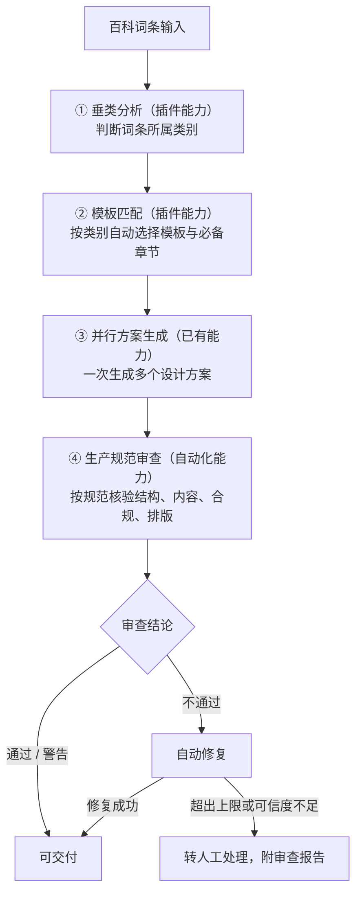

# DUDesign 功能开发路线图

> 版本：v0.4
> 日期：2026-07-02
> 文档类型：业务规划
> 适用对象：业务负责人、产品、运营及非技术相关方
> 编制说明：本文档以业务视角和非技术语言，说明 DUDesign 的业务目标、当前进展以及后续八周的功能开发节奏。文档遵循滚动更新原则，随实际进度同步修订。
> 关联文档：
> - 技术细节：`docs/modules/`（各模块待办与工作记录）、`docs/online-design-platform-plan.md`

---

## 1. 文档目的

本文档面向业务与管理相关方，回答三个问题：

1. DUDesign 解决什么业务问题、整体流程是怎样的；
2. 当前已经具备哪些能力，还缺哪些关键能力；
3. 后续八周按什么节奏推进，每一步带来什么业务价值。

文档刻意避免工程实现细节，相关方可基于本文进行业务判断、资源协调与进度对齐。

> **v0.4 主要修订**：自 v0.3（2026-07-01）以来，项目在底层能力上推进显著——真实账号登录、插件机制、自动修复、运行监控、模型发现等已基本完成。因此本次重新梳理"已完成"与"真正待建"，并将后续八周的重心调整为：**把百科业务逻辑接到已就绪的基础设施上、在前端把这些能力暴露出来、并完成生产上线准备**。详见第 4 节。

---

## 2. 项目概述与业务目标

DUDesign 是一条面向**百科词条**的页面生成与审查流水线。其核心业务价值在于：将一段百科词条内容，自动转化为符合生产规范、可直接交付使用的页面方案，并在过程中保证结构正确、内容合规、风格统一。

完整的业务目标包括：

- **效率**：从人工逐条制作页面，提升为系统自动生成、自动审查，显著降低人力成本。
- **质量**：通过模板规范与自动审查，保证产出页面的一致性与合规性。
- **可控**：生成、成本、用量均可观测、可限制，避免资源失控。
- **可上线**：在具备真实账号、稳定运行与安全防护后，可正式对外开放。

---

## 3. 业务流程总览

整条流水线分为五个环节。其中**垂类分析与模板匹配**依赖"插件"能力，**自动审查**依赖"自动化"能力。



> 说明：③ 并行生成已稳定可用；① ② ④ 三步的能力"底座"已就绪，但**面向百科的具体业务规则尚未落地**，这是后续工作的核心。

---

## 4. 当前能力评估（截至 2026-07-02）

### 4.1 自上一版以来的主要进展

相比 v0.3，以下能力已从"计划中"变为"已完成"：

| 能力 | 状态 | 业务意义 |
| --- | --- | --- |
| 真实账号登录（注册/登录/登出） | 已完成 | 产品具备面向真实用户的身份基础 |
| 工作区角色权限（所有者/管理/编辑/只读） | 已完成 | 多人使用与权限管控就绪 |
| 多用户数据隔离校验 | 已完成 | 用户之间数据互不可见 |
| 插件/技能机制（底座） | 已完成 | 可承载"垂类分析+模板匹配"业务逻辑 |
| 自动化修复链路（底座） | 已完成 | 可承载"生成—检查—修复"闭环 |
| 生成后自动质量检查与修复 | 已完成 | 通用质量问题（黑屏/空白/外部脚本）可自动拦截 |
| 运行监控（健康度、异常、降级） | 已完成 | 系统运行可观测、可兜底 |
| 模型自动发现与同步 | 已完成 | 可用模型列表无需人工逐个配置 |
| 任务队列可靠性（重试/超时/差错队列） | 已完成 | 高负载下任务不丢失、可恢复 |
| 设计模板包与设计规范文件导入 | 已完成 | 模板可标准化、可校验 |

### 4.2 已具备能力（面向最终用户）

- 注册、登录、登出，拥有个人工作区与角色权限。
- 输入需求或词条内容，系统并行生成多个设计方案（内部俗称"抽卡"，最多 6 个）。
- 每个方案支持桌面、平板、手机三种尺寸预览。
- 支持以文字说明或在画面上圈注的方式提出修改意见，支持历史版本回退。
- 生成后系统自动做基础质量检查，发现问题可自动修复一版。
- 支持下载与只读分享，刷新或重新进入可恢复历史进度。
- 用户界面支持中英文切换。

### 4.3 已具备能力（面向管理后台）

- 任务运行情况、方案成功与失败状态、用量与成本统计。
- 人工智能内核的运行健康度与异常告警。
- 模型服务管理与同步、用户模型权限。
- 操作审计记录、敏感信息脱敏、排障与修复工具（含重新生成截图、修复导出等）。

### 4.4 关键缺口（后续工作的重点）

底座虽已就绪，但面向百科的**业务逻辑**与**生产化**仍有明确缺口：

1. **还不能"读懂词条、自动判断类别、自动选模板"**——这是最核心的待建能力。
2. **自动审查仍偏通用**（黑屏、空白、外部脚本），**尚未按百科生产规范**（必备章节是否齐全、语调是否中立、有无营销腔等）来核验。
3. **用户在前端还不能直接选用插件、调节自动化强度、查看自动修复过程**。
4. **真正的完整文件包下载（含样式与脚本）尚未实现**，目前导出仍为占位形式。
5. **系统长期记忆用户偏好的能力（记忆库）尚未持久化**。
6. **用量与成本配额的硬性限制尚未落地**。
7. **域名与 HTTPS 尚未配置**，暂不能面向公网正式开放。

---

## 5. 开发路线图（2026-07-02 起，共八周）

### 5.1 总览

| 周次 | 主题 | 核心业务价值 | 难度 |
| --- | --- | --- | --- |
| 第 1 周 | 百科垂类体系建立，模板库按垂类重构 | 为"自动匹配模板"准备好业务骨架 | 中 |
| 第 2 周 | 垂类分析能力与自动模板匹配 | 实现词条到模板的自动匹配，降低人工、减少错配 | 高 |
| 第 3 周 | 百科生产规范自动审查 | 交付物按百科规范核验，合格方可交付 | 高 |
| 第 4 周 | 前端能力暴露与用户模板管理 | 用户可在界面上完整选用能力、管理自己的模板 | 中 |
| 第 5 周 | 能力持久化、完整文件包下载、长期记忆 | 模板与偏好跨会话生效，导出可直接用于生产 | 中 |
| 第 6 周 | 用量管控与管理端能力治理 | 用量可控、成本可控、运营可自主治理 | 中 |
| 第 7 周 | 域名安全配置、质量门禁收尾 | 面向公网开放前的安全与质量加固 | 中 |
| 第 8 周 | 上线前总验收与生产切换 | 达成正式上线条件 | 中 |

### 5.2 分周详述

#### 第 1 周（7/2 – 7/8）｜百科垂类体系建立与模板库重构

- **本周目标**：建立百科垂类分类标准，并把模板库按垂类重新组织，为自动匹配打好业务骨架。
- **主要工作**：
  - 定义百科垂类分类标准，覆盖人物、企业、产品、地点、机构、概念、作品等主要类别，明确每类的判定边界。
  - 为每一类定义必备章节结构（如企业词条应含"简介 / 业务 / 历史 / 荣誉 / 联系"等）。
  - 将现有模板库（目前为通用网页模板）重构并补充为按百科垂类组织的模板集。
  - 建立"类别—模板—必备章节"的对应规则，并支持在管理后台维护，无需开发介入。
- **预期成效**：模板与章节结构按百科业务梳理清楚，为第 2 周的自动匹配提供可匹配的对象。

#### 第 2 周（7/9 – 7/15）｜垂类分析能力与自动模板匹配（插件能力落地）

- **本周目标**：在已就绪的插件机制上，实现"输入词条—判断类别—匹配模板"的业务闭环。
- **主要工作**：
  - 实现垂类识别能力：输入词条内容后，系统自动判断所属类别，并给出判断的可信程度。
  - 可信度较低时不直接套用，而是给出候选类别供人工确认，避免误判。
  - 按"类别—模板"规则自动选择模板与必备章节。
  - 在用户前端实现"输入词条即推荐模板"，替代当前的人工选择。
  - 接入真实人工智能内核进行端到端验证。
- **预期成效**：用户提交词条后，系统自动判断类别并推荐最合适的模板，显著减少人工操作与错配；整个过程可解释、可追溯。

#### 第 3 周（7/16 – 7/22）｜百科生产规范自动审查（自动化能力落地）

- **本周目标**：在已就绪的自动修复链路上，增加面向百科的生产规范审查维度，使交付物符合正式规范。
- **主要工作**：
  - 在现有通用质量检查之外，增加百科规范维度：
    - 结构完整性：必备章节是否齐全。
    - 内容质量：信息是否完整，有无明显错误或不实内容。
    - 合规性：语调是否中立，有无营销话术或违规内容。
    - 排版规范性：是否符合百科页面排版标准。
    - 模板一致性：与所匹配模板的规范是否一致。
  - 审查结果分为三级：通过、警告（可交付但存在瑕疵）、不通过。
  - 对可修复的问题自动生成修正版本，并设置次数与成本上限。
  - 对无法自动修复或可信度不足的问题，标记转人工处理，并生成可读的审查报告。
  - 在前端展示自动修复的过程记录（修复次数、当前状态、终止原因）。
  - 在真实内核环境完成自动修复链路的端到端验证。
- **预期成效**：交付物均经过百科规范核验，显著降低人工验收成本与合规风险；问题方案可被及时拦截或修复。

#### 第 4 周（7/23 – 7/29）｜前端能力暴露与用户模板管理

- **本周目标**：让用户能在界面上完整选用各项能力，并方便地管理自己的模板与偏好。
- **主要工作**：
  - 在工作台开放插件与技能的选择入口、自动化强度的调节入口。
  - 在生成过程与结果页展示自动修复的阶段记录。
  - 增加"我的模板 / 最近使用 / 收藏"等模板管理入口，模板卡片展示配色、字体、适用场景与预览。
  - 支持在界面上传或粘贴设计规范文件，保存为个人模板。
  - 增加"保存为我的模板"与"我的偏好"入口。
- **预期成效**：用户无需理解底层概念，即可选用能力、复用历史成果，操作效率提升。

#### 第 5 周（7/30 – 8/5）｜能力持久化、完整文件包下载与长期记忆

- **本周目标**：让模板、偏好与记忆跨会话生效，并使导出物可直接用于生产。
- **主要工作**：
  - 将用户模板、能力配置等持久化存储，保证刷新或重新登录后仍可恢复。
  - 升级导出能力为完整的文件包下载（页面、样式、脚本、图片一并打包），替代当前的占位形式。
  - 建立长期记忆能力，使系统记住用户常用的类别与风格偏好，下次默认按其习惯生成（但不替代用户的最终选择）。
  - 在管理后台补充记忆审批记录的可视化。
- **预期成效**：复用更顺畅、交付物无需二次加工、产品更"懂"用户。

#### 第 6 周（8/6 – 8/12）｜用量管控与管理端能力治理

- **本周目标**：实现用量与成本的可控，并让运营能自主治理模板、插件、审查规则等业务配置。
- **主要工作**：
  - 落地用量与成本配额的硬性限制（按用户、工作区设置上限），防止资源失控。
  - 管理后台支持模板、视觉风格、配色、技能、插件、自动化强度等业务配置的维护。
  - 管理后台展示自动化审查的通过率、常见不通过原因、模板与插件的质量指标。
  - 完善成本按工作区、模型、时间范围的筛选，以及近期运行偏差事件、自动问题说明等排障信息。
- **预期成效**：运行成本可控；运营调整业务规则无需依赖开发。

#### 第 7 周（8/13 – 8/19）｜域名与安全配置、质量门禁收尾

- **本周目标**：完成面向公网开放所需的安全加固，并补齐核心逻辑的测试兜底。
- **主要工作**：
  - 完成正式域名绑定与 HTTPS 安全配置（当前测试环境仍为 HTTP）。
  - 安全加固：页面预览隔离、敏感密钥管理、分享链接收紧等。
  - 补齐核心业务逻辑的自动化测试（状态机、权限、关键流程），降低后续改动风险。
  - 启动无障碍基础支持。
  - 支持在管理后台直接切换回上一个稳定的人工智能内核版本。
- **预期成效**：具备面向公网安全开放的条件；关键逻辑有测试保障。

#### 第 8 周（8/20 – 8/26）｜上线前总验收与生产切换

- **本周目标**：完成正式上线前的全部检查与演练。
- **主要工作**：
  - 执行完整的上线前验收，覆盖功能、安全、自动审查与自动修复的端到端链路。
  - 完成数据备份与回滚演练。
  - 形成正式上线操作手册与应急处置方案。
  - 梳理由测试环境切换至生产环境的完整流程。
- **预期成效**：具备正式上线条件，上线过程可控、风险可应对。

---

## 6. 依赖关系与关键路径

各周工作之间存在明确的先后依赖，关键路径如下：

```text
第 1 周（垂类体系与模板重构） → 第 2 周（垂类分析与匹配） → 第 3 周（生产规范审查） → 第 7 周（安全与上线加固） → 第 8 周（上线）
```

要点说明：

- **第 1 周是第 2 周的前提**：模板需先按垂类整理完成，自动匹配才有可匹配的对象。
- **第 2 周是第 3 周的前提**：需先识别出词条类别，才能按对应类别的规范进行审查。
- 因此，**第 2 周若延期，第 3 周将相应顺延**。
- 第 4、5、6 周属支撑性工作，可在关键路径之外灵活调度。
- 第 7、8 周为上线必备环节，原则上不压缩。

---

## 7. 风险识别与应对

| 风险 | 业务影响 | 应对措施 |
| --- | --- | --- |
| 百科垂类分析与规范审查的业务规则较复杂，第 2、3 周存在延期可能 | 核心流水线交付延后 | 预留进度缓冲；必要时将第 4 周后置，优先保障核心流水线 |
| 第 2 周与第 3 周存在硬依赖 | 第 2 周延期连带影响第 3 周 | 严格按序推进，第 2 周先行收敛 |
| 自动审查规则需随业务迭代逐步完善 | 初期审查覆盖度可能不足 | 先落地核心维度（结构、合规），结合审查数据看板在第 6 周持续优化 |
| 完整文件包下载与长期记忆涉及底层数据结构调整 | 可能影响第 5 周稳定性 | 与能力持久化一并设计、分步验证 |
| 底层人工智能内核的并发能力受供应商限制 | 高并发生成时可能出现失败或超时 | 已采用受控并发策略（默认 3 路并行）与自动退避重试机制 |
| 域名与 HTTPS 配置依赖外部审批或证书签发 | 可能影响第 7 周进度 | 提前启动域名与证书申请，与开发并行推进 |

---

## 8. 基本假设

- 团队配置与近期产出强度保持相当（近期单日可完成多项底层能力建设）。
- 总体目标为在八周内达到可对外开放的生产版本。
- 本路线图不包含完整的多人实时协作编辑（已列入后续阶段）。
- 底层人工智能内核与模型供应商保持稳定可用。

如以上假设发生变化（如团队规模调整、上线节点变更），本路线图将相应重新校准。

---

## 9. 术语说明

| 术语 | 含义 |
| --- | --- |
| 百科词条 | 本流水线的输入原料，例如关于某家企业、人物或产品的介绍内容。 |
| 垂类 / 垂类分析 | "垂直类别"的简称；判断一个词条属于哪一类（人物、企业、产品等），称为垂类分析。 |
| 插件能力 | 本文档中特指"分析词条并匹配模板"的智能模块，受控且可配置。 |
| 自动化能力 | 本文档中特指"生成后按生产规范自动审查与修复"的质检环节。 |
| 生产规范 | 百科页面需达到的正式标准，包括结构完整、内容准确、语调中立、排版达标等。 |
| 并行方案生成 | 一次生成多个不同设计方案；内部俗称"抽卡"。 |
| 模板 | 预设的页面版式与章节结构，按百科垂类组织。 |
| 自动修复 | 系统在发现质量问题后，自动再生成一版修正结果的过程，设有次数与成本上限。 |
| 域名 / HTTPS | 网站的访问地址与其安全加密机制，是面向真实用户使用的前提。 |
| 用量与成本配额 | 对每位用户或工作区的生成次数与花费设置上限，避免资源失控。 |
| 记忆库 | 系统长期记住用户常用偏好的能力，用于下次默认按其习惯生成。 |

---

## 10. 文档维护

- 本文档随项目进度滚动更新，每完成一个阶段即同步修订实际进展与后续安排。
- 业务相关方如需了解底层技术实现，请参阅 `docs/modules/` 下各模块文档。
- 对路线图优先级或节奏的任何调整，将在本文档版本号与编制说明中记录。

### 版本记录

| 版本 | 日期 | 主要变更 |
| --- | --- | --- |
| v0.3 | 2026-07-01 | 初版正式业务路线图，确立百科流水线视角与八周计划 |
| v0.4 | 2026-07-02 | 据实重估：真实登录、插件底座、自动修复、运行监控等已完成；后续重心调整为百科业务逻辑落地、前端能力暴露与生产上线 |
