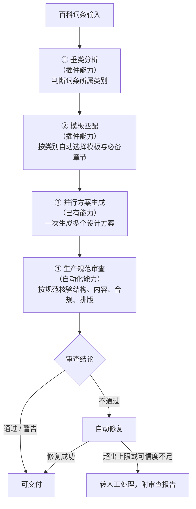

# DUDesign 功能开发路线图

> 版本：v0.3
> 日期：2026-07-01
> 文档类型：业务规划
> 适用对象：业务负责人、产品、运营及非技术相关方
> 编制说明：本文档以业务视角和非技术语言，说明 DUDesign 的业务目标、当前进展以及后续八周的功能开发节奏。文档遵循滚动更新原则，随实际进度同步修订。
> 关联文档：
> - 通俗进度版（较早版本，措辞更轻松）：见本仓库历史版本
> - 技术细节：`docs/modules/`（各模块待办与工作记录）、`docs/online-design-platform-plan.md`

---

## 1. 文档目的

本文档面向业务与管理相关方，回答三个问题：

1. DUDesign 解决什么业务问题、整体流程是怎样的；
2. 当前已经具备哪些能力，还缺哪些关键能力；
3. 后续八周按什么节奏推进，每一步带来什么业务价值。

文档刻意避免工程实现细节，相关方可基于本文进行业务判断、资源协调与进度对齐。

---

## 2. 项目概述与业务目标

DUDesign 是一条面向**百科词条**的页面生成与审查流水线。其核心业务价值在于：将一段百科词条内容，自动转化为符合生产规范、可直接交付使用的页面方案，并在过程中保证结构正确、内容合规、风格统一。

完整的业务目标包括：

- **效率**：从人工逐条制作页面，提升为系统自动生成、自动审查，显著降低人力成本。
- **质量**：通过模板规范与自动审查，保证产出页面的一致性与合规性。
- **可控**：生成、成本、用量均可观测、可限制，避免资源失控。
- **可上线**：在具备真实账号、稳定运行与安全防护后，可正式对外开放。

---

## 3. 业务流程总览

整条流水线分为五个环节。其中**垂类分析与模板匹配**依赖"插件"能力，**自动审查**依赖"自动化"能力，二者是当前最重要的待建设部分。



环节说明：

| 环节 | 能力归属 | 当前状态 |
| --- | --- | --- |
| ① 垂类分析 | 插件能力（第 2 周） | 待建设 |
| ② 模板匹配 | 插件能力（第 2 周） | 待建设 |
| ③ 并行方案生成 | 已有能力 | 已可用 |
| ④ 生产规范审查 | 自动化能力（第 3 周） | 待建设 |

---

## 4. 当前能力评估

### 4.1 已具备能力

面向最终用户：

- 输入一段需求或词条内容，系统可并行生成多个设计方案（内部俗称"抽卡"，最多 6 个）。
- 每个方案支持桌面、平板、手机三种尺寸预览。
- 支持对选中方案以文字说明或在画面上圈注的方式提出修改意见。
- 支持下载设计方案，以及生成只读分享链接。
- 浏览器刷新或重新进入后，可恢复历史进度。

面向管理后台：

- 可查看任务运行情况、方案成功与失败状态。
- 可查看用量与成本统计。
- 可查看底层人工智能内核的运行健康度。
- 可确认不同用户的数据相互隔离。
- 保留完整的操作审计记录。

### 4.2 关键缺口

当前主链路虽已跑通，但在流水线两端尚有重要能力未建设：

- **前端缺少智能分析**：输入词条后，系统尚不能自动判断其所属类别，需由人工选择模板。
- **后端缺少规范审查**：方案生成后直接交付，未按百科生产规范进行自动核验。

上述两项分别对应第 2 周（插件能力）与第 3 周（自动化能力），是后续工作的核心。

---

## 5. 开发路线图（2026-07-01 起，共八周）

### 5.1 总览

| 周次 | 主题 | 核心业务价值 | 难度 |
| --- | --- | --- | --- |
| 第 1 周 | 模板按百科类别整理，完成域名与安全配置 | 为自动匹配模板奠定基础，并具备真实用户试用条件 | 中 |
| 第 2 周 | 垂类分析与模板匹配（插件能力） | 实现词条到模板的自动匹配，降低人工、减少错配 | 高 |
| 第 3 周 | 生产规范自动审查（自动化能力） | 保障交付物合规，降低人工验收成本与风险 | 高 |
| 第 4 周 | 偏好记忆与完整文件包下载 | 提升复用效率，交付物可直接用于生产 | 中 |
| 第 5 周 | 真实账号登录 | 具备对外开放与身份管理的基本条件 | 高 |
| 第 6 周 | 运行监控、用量限制与模型发现 | 保障稳定运行、成本可控、问题可兜底 | 中 |
| 第 7 周 | 后台治理与审查规则可配置 | 提升运营自主性，质检进一步精细化 | 中 |
| 第 8 周 | 上线前总验收与演练 | 达成正式上线条件 | 中 |

### 5.2 分周详述

#### 第 1 周（7/1 – 7/7）｜模板基础整理与环境配置

- **本周目标**：为"自动匹配模板"准备好结构化的模板库，并完成测试环境的正式化配置。
- **主要工作**：
  - 将模板库按百科类别重新组织，覆盖人物、企业、产品、地点、机构、概念、作品等主要类别。
  - 每类模板内置该类别应有的章节结构（如企业词条自带"公司简介 / 业务范围 / 发展历程 / 荣誉 / 联系方式"等占位骨架）。
  - 支持导入设计规范文件并自动校验其合规性。
  - 完成测试环境的域名绑定与 HTTPS 安全配置。
- **预期成效**：模板覆盖更完整、分类更清晰；测试环境可安全地发给真实用户试用。

#### 第 2 周（7/8 – 7/14）｜垂类分析与模板匹配（插件能力）

- **本周目标**：使系统具备"读懂词条、自动选模板"的能力。
- **主要工作**：
  - 建立百科垂类分类标准，明确主要类别与判定边界。
  - 开发垂类识别能力：输入词条内容后，系统自动判断所属类别，并给出判断的可信程度；可信度较低时不直接套用，而是给出候选类别供人工确认，避免误判。
  - 建立"类别—模板"对应规则：每一类绑定推荐模板与必备章节结构。
  - 上述分类标准与对应规则支持在管理后台维护，无需开发介入。
- **预期成效**：用户提交词条后，系统自动判断类别并推荐最合适的模板，减少人工操作与错配风险；整个过程可解释、可追溯。

#### 第 3 周（7/15 – 7/21）｜生产规范自动审查（自动化能力）

- **本周目标**：在方案生成后自动进入审查环节，按百科生产规范核验，合格方可交付。
- **主要工作**：
  - 在并行生成完成后，自动进入审查环节；未经审查的方案不标记为可交付。
  - 按百科生产规范进行多维度核验：
    - 结构完整性：必备章节是否齐全。
    - 内容质量：信息是否完整，有无明显错误或不实内容。
    - 合规性：语调是否中立，有无营销话术或违规内容。
    - 排版规范性：是否符合百科页面排版标准。
    - 模板一致性：与所匹配模板的规范是否一致。
  - 审查结果分为三级：通过、警告（可交付但存在瑕疵）、不通过。
  - 对可修复的问题，系统自动生成修正版本，并设置次数与成本上限，避免无限重试。
  - 对无法自动修复或可信度不足的问题，标记转人工处理，并生成可读的审查报告，列明问题与原因。
- **预期成效**：交付物均经过规范核验，显著降低人工验收成本与合规风险；问题方案可被及时拦截或修复。

> 说明：审查规则的精细化配置与审查数据看板，将在第 7 周随后台治理一并完善。

#### 第 4 周（7/22 – 7/28）｜偏好记忆与完整下载

- **本周目标**：提升复用效率，使交付物可直接用于生产。
- **主要工作**：
  - 系统记忆用户常用的类别与风格偏好，下次默认按其习惯生成，但不替代用户的最终选择。
  - 下载内容升级为完整文件包（页面、样式、脚本、图片一并打包）。
  - 支持将满意的设计保存为个人模板，便于复用。
- **预期成效**：减少重复操作；交付物无需二次加工即可使用。

#### 第 5 周（7/29 – 8/4）｜真实账号登录

- **本周目标**：建立正式的账号体系，使产品具备对外开放条件。
- **主要工作**：
  - 上线注册与登录功能（替代当前的开发模式）。
  - 支持密码保护与私密分享链接。
  - 建立工作区内的基础角色区分（所有者、可编辑、只读），为后续协作打基础。
- **预期成效**：产品可面向真实用户提供服务，身份与权限可管理。

#### 第 6 周（8/5 – 8/11）｜运行监控与用量管控

- **本周目标**：保障系统稳定运行、成本可控、问题可兜底。
- **主要工作**：
  - 后台完善运行健康度监控（响应速度、错误、内核告警等）。
  - 设置用量与成本上限，防止资源失控。
  - 系统自动发现并展示当前可用的人工智能模型。
  - 在内核异常时，支持切换回上一个稳定版本，不影响已有成果。
- **预期成效**：运行可观测、成本可控制、故障可恢复。

#### 第 7 周（8/12 – 8/18）｜后台治理与质检精细化

- **本周目标**：提升运营自主性，使审查与模板管理无需依赖开发。
- **主要工作**：
  - 管理后台支持模板、类别映射规则、审查标准的维护。
  - 第 3 周的自动审查升级为规则可配置，并提供审查数据看板（通过率、常见不通过原因等）。
  - 强化对全黑、空白、加载异常等不合格页面的识别。
  - 启动无障碍基础支持。
  - 完善后台排障能力（重新生成截图、修复导出、撤销分享等）。
- **预期成效**：运营可自主调整业务规则；质检更精细、更可控。

#### 第 8 周（8/19 – 8/25）｜上线前总验收与演练

- **本周目标**：完成正式上线前的全部检查与演练。
- **主要工作**：
  - 执行完整的上线前验收，覆盖功能、安全、数据备份与回滚演练。
  - 形成正式上线操作手册与应急处置方案。
  - 梳理由测试环境切换至生产环境的完整流程。
- **预期成效**：具备正式上线条件，上线过程可控、风险可应对。

---

## 6. 依赖关系与关键路径

各周工作之间存在明确的先后依赖，关键路径如下：

```text
第 1 周（模板基础） → 第 2 周（垂类分析与匹配） → 第 3 周（自动审查） → 第 5 周（账号登录） → 第 8 周（上线）
```

要点说明：

- **第 1 周是第 2 周的前提**：模板需先按类别整理完成，自动匹配才有可匹配的对象。
- **第 2 周是第 3 周的前提**：需先识别出词条类别，才能按对应类别的规范进行审查。
- 因此，**第 2 周若延期，第 3 周将相应顺延**。
- 第 4、6、7 周属支撑性工作，可在关键路径之外灵活调度。

---

## 7. 风险识别与应对

| 风险 | 业务影响 | 应对措施 |
| --- | --- | --- |
| 垂类分析与自动审查业务逻辑复杂，第 2、3 周存在延期可能 | 核心流水线交付延后 | 预留进度缓冲；必要时将第 4 周后置，优先保障核心流水线 |
| 第 2 周与第 3 周存在硬依赖 | 第 2 周延期连带影响第 3 周 | 严格按序推进，第 2 周先行收敛 |
| 真实账号登录为对外开放的硬性前提 | 影响整体对外时间表 | 资源冲突时优先保障第 5 周 |
| 底层人工智能内核的并发能力受供应商限制 | 高并发生成时可能出现失败或超时 | 已采用受控并发策略（默认 3 路并行）与自动退避重试机制 |
| 自动审查规则需随业务迭代逐步完善 | 初期审查覆盖度可能不足 | 先落地核心维度，结合审查数据看板在第 7 周持续优化 |

---

## 8. 基本假设

- 团队配置与近期产出强度保持相当。
- 总体目标为逐步达到可对外开放的生产版本。
- 本路线图不包含完整的多人协作功能（已列入后续阶段）。
- 底层人工智能内核与模型供应商保持稳定可用。

如以上假设发生变化（如团队规模调整、上线节点变更），本路线图将相应重新校准。

---

## 9. 术语说明

| 术语 | 含义 |
| --- | --- |
| 百科词条 | 本流水线的输入原料，例如关于某家企业、人物或产品的介绍内容。 |
| 垂类 / 垂类分析 | "垂直类别"的简称；判断一个词条属于哪一类（人物、企业、产品等），称为垂类分析。 |
| 插件能力 | 本文档中特指"分析词条并匹配模板"的智能模块，受控且可配置。 |
| 自动化能力 | 本文档中特指"生成后按生产规范自动审查与修复"的质检环节。 |
| 生产规范 | 百科页面需达到的正式标准，包括结构完整、内容准确、语调中立、排版达标等。 |
| 并行方案生成 | 一次生成多个不同设计方案；内部俗称"抽卡"。 |
| 模板 | 预设的页面版式与章节结构，按百科类别组织。 |
| 域名 / HTTPS | 网站的访问地址与其安全加密机制，是面向真实用户使用的前提。 |
| 用量与成本限制 | 对每位用户的生成次数与花费设置上限，避免资源失控。 |

---

## 10. 文档维护

- 本文档随项目进度滚动更新，每完成一个阶段即同步修订实际进展与后续安排。
- 业务相关方如需了解底层技术实现，请参阅 `docs/modules/` 下各模块文档。
- 对路线图优先级或节奏的任何调整，将在本文档版本号与编制说明中记录。
