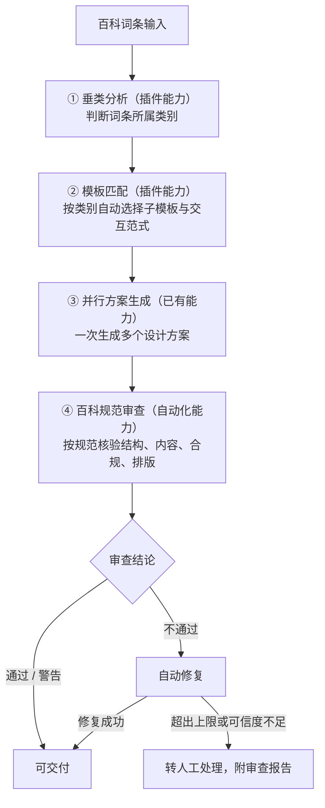

# DUDesign 功能开发路线图

> 版本：v0.7
> 日期：2026-07-08
> 文档类型：业务规划
> 适用对象：业务负责人、产品、运营及非技术相关方
> 编制说明：本文档以业务视角和非技术语言，说明 DUDesign 的业务背景、整体流程、依赖关系、风险与术语；**当前能力评估与八周开发路线图**已拆分至 `docs/capability-assessment-and-roadmap.md`，便于单独传阅与维护。文档遵循滚动更新原则，随实际进度同步修订。
> 关联文档：
> - 当前能力评估与路线图（拆分版）：`docs/capability-assessment-and-roadmap.md`
> - 技术细节：`docs/modules/`（各模块待办与工作记录）
> - 总体产品规划：`docs/online-design-platform-plan.md`
> - 动态百科业务逻辑：`docs/dynamic-encyclopedia-card-business-logic-plan.md`

---

## 1. 文档目的

本文档面向业务与管理相关方，说明 DUDesign 的业务背景、整体流程、依赖关系、风险与术语。**当前能力评估（已具备能力与关键缺口）与八周开发路线图**已拆分至独立文件 [`capability-assessment-and-roadmap.md`](capability-assessment-and-roadmap.md)，便于单独传阅与维护。

文档刻意避免工程实现细节，相关方可基于本文与拆分文件进行业务判断、资源协调与进度对齐。

> **v0.6 主要修订**：自 v0.5（2026-07-06）以来，第三方登录、管理端写侧治理、网络搜索与图片生成两项外部能力、运行监控治理面板与能力降级提示等已落地。动态百科核心业务线已基本完成并具备真实环境冒烟能力。后续八周重心收敛为：**真实环境联调收尾、管理端治理补齐、四大生产化缺口（完整下载/记忆库/配额/HTTPS）、质量测试收尾与正式上线**。详见 `docs/capability-assessment-and-roadmap.md`。

> **v0.7 结构调整**：将原"当前能力评估"与"开发路线图"两节拆分至 `docs/capability-assessment-and-roadmap.md`。本文保留项目背景、业务流程、依赖关系、风险、假设与术语；周次详情见该拆分文件。

---

## 2. 项目概述与业务目标

DUDesign 是一条面向**百科词条**的页面生成与审查流水线。其核心业务价值在于：将一段百科词条内容，自动转化为符合生产规范、可直接交付使用的动态百科卡片，并在过程中保证结构正确、内容合规、风格统一。

完整的业务目标包括：

- **效率**：从人工逐条制作页面，提升为系统自动分类、自动匹配模板、自动生成、自动审查，显著降低人力成本。
- **质量**：通过模板规范与自动审查，保证产出卡片的一致性与合规性。
- **可控**：生成、成本、用量均可观测、可限制，避免资源失控。
- **可上线**：在具备真实账号、稳定运行与安全防护后，可正式对外开放。

---

## 3. 业务流程总览

整条流水线分为五个环节。其中**垂类分析与模板匹配**依赖"插件"能力，**自动审查**依赖"自动化"能力。


```mermaid
flowchart TD
  E[百科词条输入] --> A
  A["① 垂类分析（插件能力）<br/>判断词条所属类别"] --> B
  B["② 模板匹配（插件能力）<br/>按类别自动选择子模板与交互范式"] --> C
  C["③ 并行方案生成（已有能力）<br/>一次生成多个设计方案"] --> D
  D["④ 百科规范审查（自动化能力）<br/>按规范核验结构、内容、合规、排版"] --> R{审查结论}
  R -->|通过 / 警告| P[可交付]
  R -->|不通过| F[自动修复]
  F -->|修复成功| P
  F -->|超出上限或可信度不足| H[转人工处理，附审查报告]
```

> 说明：截至本版，①②③④ 四步的"底座"与"百科业务规则"均已落地，且③④已可在真实人工智能内核环境下冒烟验证。剩余主要是把全部能力在真实环境下端到端跑通、由管理端形成治理闭环，并补齐生产化缺口后正式上线。

---

## 4. 依赖关系与关键路径

> 以下周次对应 [`capability-assessment-and-roadmap.md`](capability-assessment-and-roadmap.md) 第 2 节"开发路线图"。

各周工作之间存在明确的先后依赖，关键路径如下：

```text
第 1 周（真实联调与写侧治理） → 第 3 周（完整下载与记忆库） → 第 4 周（配额与安全） → 第 7 周（上线演练） → 第 8 周（上线）
```

要点说明：

- **第 1 周是治理数据来源的前提**：先在真实环境跑通，第 2 周治理面板才有真实数据可看。
- **第 3、4 周是上线的硬性前提**：完整下载、记忆库、配额、HTTPS 缺一不可，原则上不压缩。
- **第 2、5 周为支撑性工作**，可在关键路径之外灵活调度。
- **第 6 周为扩展性工作**，资源不足时可后置到上线后滚动推进，不阻塞上线。

---

## 5. 风险识别与应对

| 风险 | 业务影响 | 应对措施 |
| --- | --- | --- |
| 四大生产化缺口（完整下载/记忆库/配额/HTTPS）已跨多版待办 | 集中在前期可能造成进度压力 | 第 3、4 周排期优先级最高，必要时将第 6 周扩展工作后置让路 |
| 真实环境联调可能暴露分类或审查规则不足 | 第 1 周可能延期并影响后续 | 预留缓冲；联调中发现的问题优先补规则 |
| 域名与 HTTPS 依赖外部审批或证书签发 | 可能影响第 4 周进度 | 提前启动域名与证书申请，与开发并行推进 |
| 第三方登录与外部能力依赖第三方服务 | 可用性与成本不可控 | 设计时即含降级路径，不阻塞主流程 |
| 底层人工智能内核并发能力受供应商限制 | 高并发生成可能出现失败或超时 | 已采用受控并发策略（默认 3 路并行）与自动退避重试机制 |
| 自动审查规则需随业务迭代逐步完善 | 初期审查覆盖度可能不足 | 先落地核心维度，结合第 2 周治理数据持续优化 |

---

## 6. 基本假设

- 团队配置与近期产出强度保持相当（近期单日可完成多项能力建设）。
- 总体目标为在八周内达到可对外开放的生产版本；外部能力扩展（第 6 周）在资源不足时可后置到上线后滚动推进。
- 本路线图不包含完整的多人实时协作编辑（已列入后续阶段）。
- 底层人工智能内核与模型供应商保持稳定可用。

如以上假设发生变化（如团队规模调整、上线节点变更），本路线图将相应重新校准。

---

## 7. 术语说明

| 术语 | 含义 |
| --- | --- |
| 百科词条 | 本流水线的输入原料，例如关于某家企业、人物或产品的介绍内容。 |
| 动态百科卡片 | 面向百科词条的可交互卡片式页面，是 DUDesign 的核心产物形态之一。 |
| 垂类 / 垂类分析 | "垂直类别"的简称；判断一个词条属于哪一类（人物、企业、产品等），称为垂类分析。 |
| 子模板 / 交互范式 | 子模板是具体的卡片版式（摘要卡、时间线卡等）；交互范式是内容被探索的方式（时间线叙事、热区探索等）。 |
| 插件能力 | 本文档中特指"分析词条并匹配模板"的智能模块，受控且可配置。 |
| 自动化能力 | 本文档中特指"生成后按百科规范自动审查与修复"的质检环节。 |
| 生产规范 | 百科页面需达到的正式标准，包括结构完整、内容准确、语调中立、排版达标等。 |
| 词条引导 | 输入词条后，系统自动完成资料查询、分类、推荐模板的业务向导。 |
| MCP | 插件调用外部能力（如资料查询、网络搜索、图片生成）的受控通道，可管控、可审计。 |
| 并行方案生成 | 一次生成多个不同设计方案；内部俗称"抽卡"。 |
| 自动修复 | 系统在发现质量问题后，自动再生成一版修正结果的过程，设有次数与成本上限。 |
| 域名 / HTTPS | 网站的访问地址与其安全加密机制，是面向真实用户使用的前提。 |
| 用量与成本配额 | 对每位用户或工作区的生成次数与花费设置上限，避免资源失控。 |
| 记忆库 | 系统长期记住用户常用偏好的能力，用于下次默认按其习惯生成。 |

---

## 8. 文档维护

- 本文档随项目进度滚动更新，每完成一个阶段即同步修订实际进展与后续安排。
- "当前能力评估"与"开发路线图"维护在拆分文件 `docs/capability-assessment-and-roadmap.md`，与本文件保持同步。
- 业务相关方如需了解底层技术实现，请参阅 `docs/modules/` 下各模块文档。
- 对路线图优先级或节奏的任何调整，将在本文档版本号与编制说明中记录。

### 版本记录

| 版本 | 日期 | 主要变更 |
| --- | --- | --- |
| v0.3 | 2026-07-01 | 初版正式业务路线图，确立百科流水线视角与八周计划 |
| v0.4 | 2026-07-02 | 据实重估：真实登录、插件底座、自动修复、运行监控等已完成；后续重心调整为百科业务逻辑落地、前端能力暴露与生产上线 |
| v0.5 | 2026-07-06 | 再次据实重估：动态百科业务线（垂类分类、子模板、词条引导、规范审查、前端暴露、能力持久化、MCP 调用治理）已大量落地；后续重心调整为真实内核联调、管理端写侧治理、生产化缺口补齐、外部能力扩展与上线 |
| v0.6 | 2026-07-08 | 第三次据实重估：第三方登录、管理端写侧治理、网络搜索与图片生成能力、MCP 治理面板与降级提示已落地；后续重心收敛为真实联调收尾、管理端治理补齐、四大生产化缺口、质量测试收尾与正式上线 |
| v0.7 | 2026-07-08 | 结构调整：将"当前能力评估"与"开发路线图"两节拆分至 `docs/capability-assessment-and-roadmap.md`；本文保留背景、流程、依赖、风险、假设与术语 |
