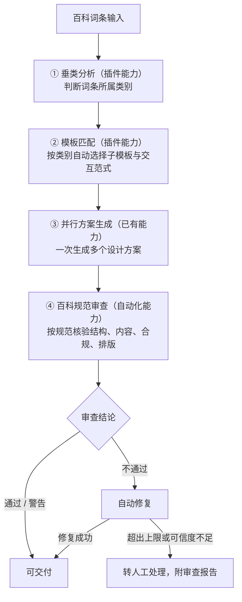

# DUDesign 功能开发路线图

> 版本：v0.5
> 日期：2026-07-06
> 文档类型：业务规划
> 适用对象：业务负责人、产品、运营及非技术相关方
> 编制说明：本文档以业务视角和非技术语言，说明 DUDesign 的业务目标、当前进展以及后续八周的功能开发节奏。文档遵循滚动更新原则，随实际进度同步修订。
> 关联文档：
> - 技术细节：`docs/modules/`（各模块待办与工作记录）
> - 总体产品规划：`docs/online-design-platform-plan.md`
> - 动态百科业务逻辑：`docs/dynamic-encyclopedia-card-business-logic-plan.md`

---

## 1. 文档目的

本文档面向业务与管理相关方，回答三个问题：

1. DUDesign 解决什么业务问题、整体流程是怎样的；
2. 当前已经具备哪些能力，还缺哪些关键能力；
3. 后续八周按什么节奏推进，每一步带来什么业务价值。

文档刻意避免工程实现细节，相关方可基于本文进行业务判断、资源协调与进度对齐。

> **v0.5 主要修订**：自 v0.4（2026-07-02）以来，动态百科卡片业务线（即原头号缺口"百科垂类分析+模板匹配+规范审查"）已在专门分支上大量落地——产品模式、垂类分类、子模板与交互范式、词条引导、百科规范审查、前端能力暴露与能力持久化均已完成或基本完成。因此本次再次重估"已完成"与"真正待建"，并将后续八周重心调整为：**动态百科核心业务线在真实内核上端到端联调、管理端治理写侧、补齐生产化缺口（完整下载/记忆库/配额/HTTPS）、外部能力扩展与正式上线**。详见第 4 节。

---

## 2. 项目概述与业务目标

DUDesign 是一条面向**百科词条**的页面生成与审查流水线。其核心业务价值在于：将一段百科词条内容，自动转化为符合生产规范、可直接交付使用的动态百科卡片，并在过程中保证结构正确、内容合规、风格统一。

完整的业务目标包括：

- **效率**：从人工逐条制作页面，提升为系统自动分类、自动匹配模板、自动生成、自动审查，显著降低人力成本。
- **质量**：通过模板规范与自动审查，保证产出卡片的一致性与合规性。
- **可控**：生成、成本、用量均可观测、可限制，避免资源失控。
- **可上线**：在具备真实账号、稳定运行与安全防护后，可正式对外开放。

---

## 3. 业务流程总览

整条流水线分为五个环节。其中**垂类分析与模板匹配**依赖"插件"能力，**自动审查**依赖"自动化"能力。


```mermaid
flowchart TD
  E[百科词条输入] --> A
  A["① 垂类分析（插件能力）<br/>判断词条所属类别"] --> B
  B["② 模板匹配（插件能力）<br/>按类别自动选择子模板与交互范式"] --> C
  C["③ 并行方案生成（已有能力）<br/>一次生成多个设计方案"] --> D
  D["④ 百科规范审查（自动化能力）<br/>按规范核验结构、内容、合规、排版"] --> R{审查结论}
  R -->|通过 / 警告| P[可交付]
  R -->|不通过| F[自动修复]
  F -->|修复成功| P
  F -->|超出上限或可信度不足| H[转人工处理，附审查报告]
```

> 说明：截至本版，①②③④ 四步的"底座"与"百科业务规则"均已基本落地；剩余主要是将其在真实人工智能内核上端到端跑通，并由管理端形成治理闭环。

---

## 4. 当前能力评估（截至 2026-07-06）

### 4.1 自上一版以来的主要进展

相比 v0.4，以下能力已从"计划中"变为"已完成或基本完成"：

| 能力 | 状态 | 业务意义 |
| --- | --- | --- |
| 动态百科产品模式（与 Web&App 并列） | 已完成 | 用户可专门生成百科卡片，且不影响原有网页生成 |
| 百科垂类分类体系（L1/L2/L3）与词条引导 | 已完成 | 输入词条即可自动判断类别与置信度 |
| 百科子模板（摘要/时间线/关系/对比/可展开）与交互范式 | 已完成 | 按内容类别匹配最合适的卡片版式与互动方式 |
| 百科规范自动审查与修复策略 | 已完成 | 按百科规范核验，不合格可自动修复 |
| 词条引导能力拆分为技能+工具+向导 | 已完成 | 业务编排可解释、可追溯、可审计 |
| 前端能力完整暴露（插件/自动化强度/模板库/我的模板/设计规范上传） | 已完成 | 用户可在界面上完整选用全部能力 |
| 能力持久化（模板表/版本/使用事件/用户偏好） | 已完成 | 模板与偏好跨会话生效，历史任务不受模板更新影响 |
| 双端差异化策略与数据输入分析技能 | 已完成 | 同一需求按 PC/移动差异生成；松散资料先结构化再生成 |
| MCP 调用契约、授权审计、HTTP 传输与降级 | 已完成 | 插件调用可管控、可观测、可兜底 |
| 管理端通用能力治理（只读） | 已完成 | 运营可查看官方模板、业务模板包与质量 lint |

### 4.2 已具备能力（面向最终用户）

- 注册、登录、登出，拥有个人工作区与角色权限。
- 可在"Web&App"与"动态百科卡片"两种产品模式间切换。
- 输入百科词条后，系统自动判断垂类、推荐子模板与交互范式，置信度低时支持人工确认。
- 并行生成多个设计方案，支持桌面、平板、手机预览，支持文字与圈画精修、历史版本回退。
- 生成后自动做质量检查与百科规范审查，发现问题可自动修复一版。
- 可选用插件与自动化强度，可上传设计规范文件保存为个人模板，可保存偏好。
- 支持下载与只读分享，刷新或重新进入可恢复历史进度；界面支持中英文。

### 4.3 已具备能力（面向管理后台）

- 任务运行情况、用量与成本统计、人工智能内核运行健康度与异常告警。
- 模型服务管理与同步、用户模型权限。
- 官方模板、业务模板包及其子模板的只读治理视图与质量 lint 展示。
- 操作审计记录、敏感信息脱敏、排障与修复工具。

### 4.4 关键缺口（后续工作的重点）

尽管百科业务线已大量落地，仍存在以下明确缺口：

1. **动态百科核心业务线尚未在真实内核上端到端联调**——词条资料查询仍为模拟，真实环境下的分类、匹配、生成、审查、修复全链路冒烟待补。
2. **管理端治理以"读"为主**——模板与分类的编辑、发布、禁用等写操作及审计尚未落地；动态百科专项治理面板（命中率、审查通过率、修复成功率等）尚未建立。
3. **完整文件包下载（含样式与脚本）尚未实现**，导出仍为占位形式。
4. **长期记忆库尚未持久化**，系统尚不能跨会话沉淀用户偏好与记忆审批记录。
5. **用量与成本配额的硬性限制尚未落地**。
6. **域名与 HTTPS 未配置**，暂不能面向公网正式开放。
7. **外部能力扩展尚未开始**（网络信息搜索、图片生成等增强能力）。
8. **核心逻辑的自动化测试与无障碍支持待补齐**。

---

## 5. 开发路线图（2026-07-07 起，共八周）

### 5.1 总览

| 周次 | 主题 | 核心业务价值 | 难度 |
| --- | --- | --- | --- |
| 第 1 周 | 动态百科真实内核端到端联调 | 验证核心业务线在真实环境跑通 | 高 |
| 第 2 周 | 管理端能力治理（读侧）与动态百科治理面板 | 运营可观测百科业务运行情况 | 中 |
| 第 3 周 | 管理端能力治理（写侧）与审计 | 运营可自主维护模板、分类与规则 | 中 |
| 第 4 周 | 完整文件包下载与长期记忆库 | 导出可直接交付、产品更懂用户 | 中 |
| 第 5 周 | 用量配额、成本上限、域名与安全配置 | 面向公网开放前的可控与安全 | 中 |
| 第 6 周 | 质量与测试收尾 | 核心逻辑有测试兜底，运行更稳 | 中 |
| 第 7 周 | 外部能力扩展（网络搜索与图片生成） | 增强生成丰富度（可在上线后滚动） | 中 |
| 第 8 周 | 上线前总验收与生产切换 | 达成正式上线条件 | 中 |

### 5.2 分周详述

#### 第 1 周（7/7 – 7/13）｜动态百科真实内核端到端联调

- **本周目标**：把动态百科核心业务线从模拟环境推进到真实人工智能内核上端到端跑通。
- **主要工作**：
  - 将词条资料查询由模拟升级为真实只读服务，并完成授权与审计。
  - 在真实内核环境下完成"输入词条—分类—匹配模板—并行生成—规范审查—自动修复"全链路冒烟验证。
  - 补充插件调用在真实环境下的授权、审计、结果注入与降级验证。
  - 增补"可展开事实卡"之外的首批探索互动卡（作为下一批扩展）。
- **预期成效**：核心业务线在真实环境下可稳定跑通，为后续上线提供事实依据。

#### 第 2 周（7/14 – 7/20）｜管理端能力治理（读侧）与动态百科治理面板

- **本周目标**：让运营能在管理后台看清能力配置与动态百科业务的运行情况。
- **主要工作**：
  - 管理端展示设计规范文件的校验结果、技能列表、插件调用策略与灰度状态、能力使用统计。
  - 建立动态百科专项治理面板：父/子模板与交互范式视图、分类映射视图、词条资料工具健康与调用审计。
  - 展示词条引导命中率、低置信度比例、人工确认比例。
  - 展示百科规范审查通过率、常见失败原因（含审查上下文）、自动修复成功率。
- **预期成效**：运营对百科业务的可观测性完整，能为后续调优与治理提供数据支撑。

#### 第 3 周（7/21 – 7/27）｜管理端能力治理（写侧）与审计

- **本周目标**：让运营能自主维护模板、分类与规则，且所有变更可审计。
- **主要工作**：
  - 开放模板的编辑、发布、下线、归档与版本对比，并写入审计日志。
  - 开放风险技能、插件、子模板、审查规则的禁用能力，并写入审计日志。
  - 开放百科分类映射的写维护与审计。
  - 补充管理端治理的页面冒烟与"禁用后用户端被拒"的联动验证。
- **预期成效**：运营调整业务规则无需依赖开发，且所有动作可追溯。

#### 第 4 周（7/28 – 8/3）｜完整文件包下载与长期记忆库

- **本周目标**：使交付物可直接用于生产，并让系统跨会话记住用户偏好。
- **主要工作**：
  - 升级导出能力为完整的文件包下载（页面、样式、脚本、图片一并打包），替代当前的占位形式。
  - 建立长期记忆库的持久化存储，使系统记住用户常用的类别与风格偏好，下次默认按其习惯生成（但不替代用户的最终选择）。
  - 在管理后台补充记忆审批记录的可视化。
- **预期成效**：导出无需二次加工；产品复用更顺畅、更"懂"用户。

#### 第 5 周（8/4 – 8/10）｜用量配额、成本上限、域名与安全配置

- **本周目标**：完成面向公网开放所需的可控性与安全加固。
- **主要工作**：
  - 落地用量与成本配额的硬性限制（按用户、工作区设置上限），防止资源失控。
  - 完成正式域名绑定与 HTTPS 安全配置（当前测试环境仍为 HTTP）。
  - 安全加固：页面预览隔离、敏感密钥管理、分享链接收紧等。
  - 启动无障碍基础支持。
- **预期成效**：运行成本可控、面向公网访问安全。

#### 第 6 周（8/11 – 8/17）｜质量与测试收尾

- **本周目标**：补齐核心逻辑的自动化测试与运行稳定性保障。
- **主要工作**：
  - 补齐核心业务逻辑的自动化测试（状态机、权限、关键流程），降低后续改动风险。
  - 将图片质量检查拆分为独立处理单元，避免拖慢生成链路。
  - 支持在管理后台直接切换回上一个稳定的人工智能内核版本。
  - 在真实内核环境完成自动修复链路的端到端验证。
- **预期成效**：关键逻辑有测试保障，运行更稳、出问题能兜底。

#### 第 7 周（8/18 – 8/24）｜外部能力扩展（网络搜索与图片生成）

- **本周目标**：引入网络信息搜索与图片生成能力，丰富生成结果（资源允许可提前，否则作为上线后滚动增强）。
- **主要工作**：
  - 引入网络信息搜索能力，为生成提供经审核的资料与引用，结果不直接注入内核。
  - 引入图片生成能力，由受控服务统一承接，预览/导出/分享只读取结果存档。
  - 为新增能力设计不可用时的降级路径，避免影响主流程。
  - 覆盖新增能力的授权、调用、审计与回放冒烟。
- **预期成效**：生成内容更丰富、更贴近真实业务需要。

#### 第 8 周（8/25 – 8/31）｜上线前总验收与生产切换

- **本周目标**：完成正式上线前的全部检查与演练。
- **主要工作**：
  - 执行完整的上线前验收，覆盖功能、安全、动态百科全链路与自动修复。
  - 完成数据备份与回滚演练。
  - 形成正式上线操作手册与应急处置方案。
  - 梳理由测试环境切换至生产环境的完整流程。
- **预期成效**：具备正式上线条件，上线过程可控、风险可应对。

---

## 6. 依赖关系与关键路径

各周工作之间存在明确的先后依赖，关键路径如下：

```text
第 1 周（真实内核联调） → 第 2/3 周（管理端治理） → 第 5 周（配额与安全） → 第 8 周（上线）
```

要点说明：

- **第 1 周是后续治理的数据来源**：先在真实环境跑通，管理端治理面板才有真实数据可看。
- **第 2 周是第 3 周的前提**：先具备只读可观测，再开放写操作与审计，避免无观测下的盲改。
- **第 4、6、7 周属支撑性或增强性工作**，可在关键路径之外灵活调度；其中第 7 周可在上线后滚动推进。
- **第 5、8 周为上线必备环节**，原则上不压缩。

---

## 7. 风险识别与应对

| 风险 | 业务影响 | 应对措施 |
| --- | --- | --- |
| 动态百科真实内核联调可能暴露分类或审查规则不足 | 第 1 周可能延期并影响后续 | 预留缓冲；联调中发现的问题优先补规则，再推进治理面板 |
| 管理端写操作涉及权限与审计 | 误操作可能影响线上业务 | 先读后写，写操作强制审计，并联动用户端拒绝验证 |
| 完整文件包下载与记忆库涉及底层数据结构调整 | 可能影响第 4 周稳定性 | 与能力持久化一并设计、分步验证 |
| 域名与 HTTPS 依赖外部审批或证书签发 | 可能影响第 5 周进度 | 提前启动域名与证书申请，与开发并行推进 |
| 外部能力（网络搜索、图片生成）依赖第三方服务 | 可用性与成本不可控 | 设计时即含降级路径，不阻塞主流程；必要时后置到上线后 |
| 底层人工智能内核并发能力受供应商限制 | 高并发生成可能出现失败或超时 | 已采用受控并发策略（默认 3 路并行）与自动退避重试机制 |
| 自动审查规则需随业务迭代逐步完善 | 初期审查覆盖度可能不足 | 先落地核心维度，结合第 2 周治理数据持续优化 |

---

## 8. 基本假设

- 团队配置与近期产出强度保持相当（近期单日可完成多项业务线建设）。
- 总体目标为在八周内达到可对外开放的生产版本；外部能力扩展（第 7 周）在资源不足时可后置到上线后滚动推进。
- 本路线图不包含完整的多人实时协作编辑（已列入后续阶段）。
- 底层人工智能内核与模型供应商保持稳定可用。

如以上假设发生变化（如团队规模调整、上线节点变更），本路线图将相应重新校准。

---

## 9. 术语说明

| 术语 | 含义 |
| --- | --- |
| 百科词条 | 本流水线的输入原料，例如关于某家企业、人物或产品的介绍内容。 |
| 动态百科卡片 | 面向百科词条的可交互卡片式页面，是 DUDesign 的核心产物形态之一。 |
| 垂类 / 垂类分析 | "垂直类别"的简称；判断一个词条属于哪一类（人物、企业、产品等），称为垂类分析。 |
| 子模板 / 交互范式 | 子模板是具体的卡片版式（摘要卡、时间线卡等）；交互范式是内容被探索的方式（时间线叙事、热区探索等）。 |
| 插件能力 | 本文档中特指"分析词条并匹配模板"的智能模块，受控且可配置。 |
| 自动化能力 | 本文档中特指"生成后按百科规范自动审查与修复"的质检环节。 |
| 生产规范 | 百科页面需达到的正式标准，包括结构完整、内容准确、语调中立、排版达标等。 |
| 词条引导 | 输入词条后，系统自动完成资料查询、分类、推荐模板的业务向导。 |
| MCP | 插件调用外部能力（如资料查询）的受控通道，可管控、可审计。 |
| 并行方案生成 | 一次生成多个不同设计方案；内部俗称"抽卡"。 |
| 自动修复 | 系统在发现质量问题后，自动再生成一版修正结果的过程，设有次数与成本上限。 |
| 域名 / HTTPS | 网站的访问地址与其安全加密机制，是面向真实用户使用的前提。 |
| 用量与成本配额 | 对每位用户或工作区的生成次数与花费设置上限，避免资源失控。 |
| 记忆库 | 系统长期记住用户常用偏好的能力，用于下次默认按其习惯生成。 |

---

## 10. 文档维护

- 本文档随项目进度滚动更新，每完成一个阶段即同步修订实际进展与后续安排。
- 业务相关方如需了解底层技术实现，请参阅 `docs/modules/` 下各模块文档。
- 对路线图优先级或节奏的任何调整，将在本文档版本号与编制说明中记录。

### 版本记录

| 版本 | 日期 | 主要变更 |
| --- | --- | --- |
| v0.3 | 2026-07-01 | 初版正式业务路线图，确立百科流水线视角与八周计划 |
| v0.4 | 2026-07-02 | 据实重估：真实登录、插件底座、自动修复、运行监控等已完成；后续重心调整为百科业务逻辑落地、前端能力暴露与生产上线 |
| v0.5 | 2026-07-06 | 再次据实重估：动态百科业务线（垂类分类、子模板、词条引导、规范审查、前端暴露、能力持久化、MCP 调用治理）已大量落地；后续重心调整为真实内核联调、管理端写侧治理、生产化缺口补齐、外部能力扩展与上线 |
